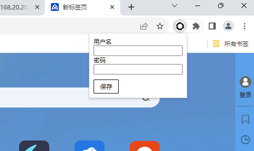
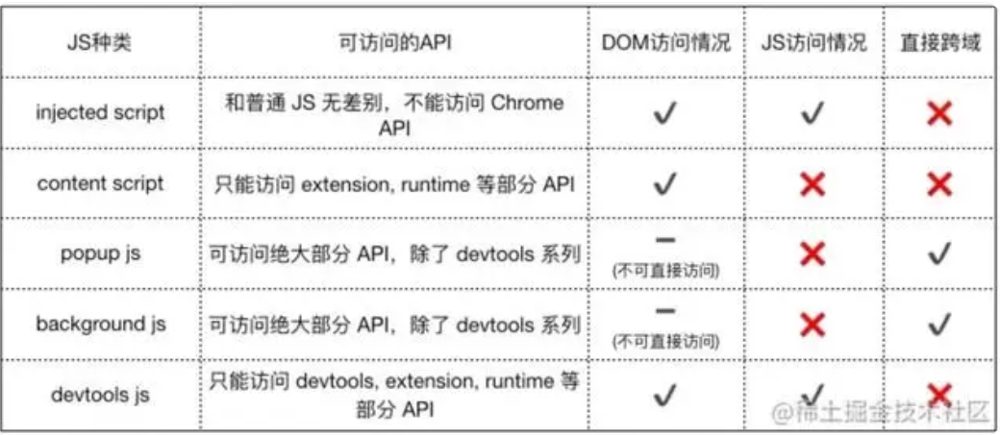

# 谷歌扩展程序

## 简介

谷歌插件（Google Chrome Extension）是指运行在谷歌浏览器上的扩展程序，它可以添加新功能、修改浏览器的外观、行为等。谷歌插件可以从Chrome网上应用店下载，也可以通过其他方式安装; 它可以运行在所有支持webkit内核的浏览器中；

## 手写一个chrome插件

### 基础目录

```js
// 
├── background.js  // 负责在浏览器后台运行插件代码
├── content.js // 负责在浏览器的网页中运行插件代码
├── popup.js // 负责在浏览器中显示一个弹出窗口js逻辑处理
├── popup.html // 负责在浏览器中显示一个弹出窗口html页面
├── manifest.json // 它用于定义插件的名称、版本、描述、图标等信息
├── icon.png // 定义插件logo ，文件大小限制 48 * 48
```
#### manifest.json
manifest.json 是 Chrome 插件开发中的一个重要文件，它用于定义插件的名称、版本、描述、图标等信息。

manifest.json 文件中可以包含以下内容： 
 
* name：插件的名称。 
* version：插件的版本。 
* description：插件的描述。 
* icons：插件的图标。 
* permissions：插件需要的权限。 
* background：插件的背景页面。 
* content：插件的网页内容。 
* popup：插件的弹出窗口。 

```json
{ 
    "name":"自动登录",
    "version":"1.0", 
    /*
    它用于确定扩展程序的版本、兼容性和更新，如果版本与谷歌
    浏览器版本不兼容则会阻止扩展程序安装 值为 2 以上的整数
    */
    "manifest_version":3,
    //它允许开发者在浏览器的网页中注入自定义的 JavaScript、CSS 和 HTML 代码。
    "content_scripts": [ 
        {
        "matches": ["http://*/*","https://*/*"], //设置匹配地址
        "js": ["content.js"], // 引入js文件
        "css": ["styles.css"], // 引入css文件
        "run_at": "document_end"
        }
    ],
    // 定义弹窗页面及插件图标
    "action":{"default_icon": "icon.png","default_popup": "popup.html"}, 
    "background": {
        "service_worker": "background.js" //引入浏览器后台执行文件
    },
    "permissions": [ //申请权限
        "storage",
        "activeTab",
        "tabs"
    ]
}
```

#### background.js
background.js 负责在浏览器后台运行插件代码。
* 在后台一直运行的脚本或页面；
* 生命周期最长，随着浏览器打开而打开，随着浏览器关闭而关闭；
* 几乎可以调用所有的 chrome API（除了 devtools），无限跨域；

background.js 文件中可以包含以下内容： 
* 全局变量和函数：用于定义插件的全局变量和函数。 
* 事件处理函数：用于处理浏览器的事件，例如页面加载、页面刷新、页面关闭等。 
* 定时器：用于在指定时间后执行代码。 
* 异步请求：用于向服务器发送请求或从服务器接收数据。 

```js
// 监听url变化， 发送通知
chrome.tabs.onUpdated.addListener(function(tabId, changeInfo, tab) {
  if (changeInfo.url) {
    chrome.tabs.sendMessage( tabId, {
        message: 'update',
        url: changeInfo.url
      })
  }
});
// 监听标签页关闭，新创建一个百度标签
chrome.tabs.onRemoved.addListener(function (tabId, removeInfo) {
  chrome.tabs.create({url: 'https://www.baidu.com'});
});

```

#### content.js

content.js 负责在浏览器的网页中运行插件代码
* 可以访问页面的DOM，但不能访问页面里的JS环境对象
* 不能访问大部分的 chrome API，
 
content.js 文件中可以包含以下内容： 
* 全局变量和函数：用于定义插件的全局变量和函数。 
* 事件处理函数：用于处理浏览器的事件，例如页面加载、页面刷新、页面关闭等。 
* 定时器：用于在指定时间后执行代码。 
* 异步请求：用于向服务器发送请求或从服务器接收数据。 

```js
// 自动登录某网址
function autoStart() {
  if(location.href.includes('9999/login') || location.href.includes('7000/login')){
        let inputClass = window.location.href.includes('9999/login')
         ? 'el-input__inner' : 'pristine';
        let btnClass = window.location.href.includes('9999/login')
         ? 'login-button-style' : 'el-button--primary';
        let inputList = document.querySelectorAll('input');
        let username = 'xxx';
        let password = 'xxx';
        if(localStorage.getItem('loginInfoData')) {
            let {user, pass} = JSON.parse(localStorage.getItem('loginInfoData'));
            username = user;
            password = pass;
        }
        inputList[0].value = username;
        inputList[1].value = password;
        var myEvent = new Event('input', {
            bubbles: true,
            cancelable: true
        });
        inputList[0].dispatchEvent(myEvent);
        inputList[1].dispatchEvent(myEvent);
        document.getElementsByClassName(btnClass)[0].click();
    }
  }
  autoStart();
  // 接收消息
  chrome.runtime.onMessage.addListener(function (requset, sender, sendResponse) {
    // 接收到submit消息将账户密码存到本地
    if(requset.message == 'submit') {
        localStorage.setItem('loginInfoData', 
        JSON.stringify({user: requset.username, pass: requset.password}));
    }
    // 监听url变化重新触发函数
    if(requset.message == 'update') autoStart();
  })

```

#### popup.html
用于显示配置弹窗



##### js文件只可以外部引入，内嵌script不生效

```html
<!DOCTYPE html>
<html lang="en">
<head>
    <meta charset="UTF-8">
    <meta name="viewport" content="width=device-width, initial-scale=1.0">
    <title>Document</title>
</head>
<style>
    #submit {
        padding: 5px;
        cursor: pointer;
        border: 1px solid #000;
        border-radius: 2px;
        width: 50px;
        text-align: center;
        box-sizing: border-box;
        margin-top: 10px;
    }
</style>
<body>
    <div class="username">用户名</div>
    <input type="text" id="user" />
    <div class="username">密码</div>
    <input type="text" id="password" />
    <div id="submit">保存</div>
    <script src="./popup.js"></script>
</body>
</html>

```
#### popup.js

用于处理弹窗内部js逻辑

```js
// 反显上次的账号密码
if(localStorage.getItem('loginInfoData')) {
    let {username, password} = JSON.parse(localStorage.getItem('loginInfoData'));
    document.getElementById('password').value = password;
    document.getElementById('user').value = username;
}
// 提交保存账户密码
document.getElementById('submit').addEventListener('click',async function() {
    let username = document.getElementById('user').value;
    let password = document.getElementById('password').value;
    // 校验
    if(!username) return alert('请填写用户名');
    if(!password) return alert('请填写密码');
    localStorage.setItem('loginInfoData', JSON.stringify({ username, password}));
    const [tab] = await chrome.tabs.query({active: true, currentWindow: true});
    const response = await chrome.tabs.sendMessage(tab.id, 
    {message: 'submit', username, password })
    window.close(); //关闭弹窗
})

```
#### icon.png

插件图标 分辨率 48 x 48

### 文件通信


发送消息分为sendMessage 短链接  connect 长链接

``` js
//使用runtime发送接收
// 收
chrome.runtime.onMessage.addListener(function (requset, sender, sendResponse) {
    if(requset.message == 'submit') {
    }
    if(requset.message == 'update') autoStart();
})
// 发
chrome.runtime.sendMessage({message: 'xxxx', value: 'xxxx'})

// 使用tabs向指定标签发送数据

// 发
const [tab] = await chrome.tabs.query({active: true, currentWindow: true});
const response = await chrome.tabs.sendMessage(tab.id, 
{message: 'submit', username, password })
// 收
chrome.runtime.onMessage.addListener(function (requset, sender, sendResponse) {
    if(requset.message == 'submit') {
    }
    if(requset.message == 'update') autoStart();
})

// 使用connect建立长链接
//发
 chrome.runtime.connect()
 
//收
chrome.runtime.onConnect.addListener()

//使用chrome.extension.getBackgroundPage()
 //方法获取 background.js 的全局对象，然后可以直接访问其中的变量和函数。
chrome.extension.getBackgroundPage() 

// popup页面打开 
 chrome.extension.getViews() //background可以使用改函数访问popup
```