# 浏览器渲染原理

## 渲染的本质
将一个编译好的html文件经过多道程序转换为像素信息，将像素信息组合成可视化的页面
```js
  function render(html) {
    // 多重计算
    //每一行。每一列的像素点信息，交由cpu，gpu渲染处理
    return pixels；
  }
```

## 渲染的时间点
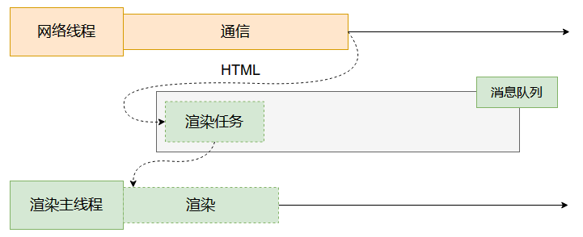
首先由网络线程通过通信拿到相应的html文件，将html文件生成一个渲染任务交由事件循环队列排队处理，到任务执行时，将任务交由渲染主线程进行渲染处理

## 渲染流程
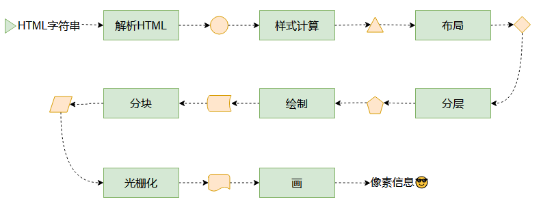

## 解析HTMl parse HTML
### 为什么要将HTML字符串解析为树形结构
因为对象结构容易处理，且较为清晰
### 解析HTML
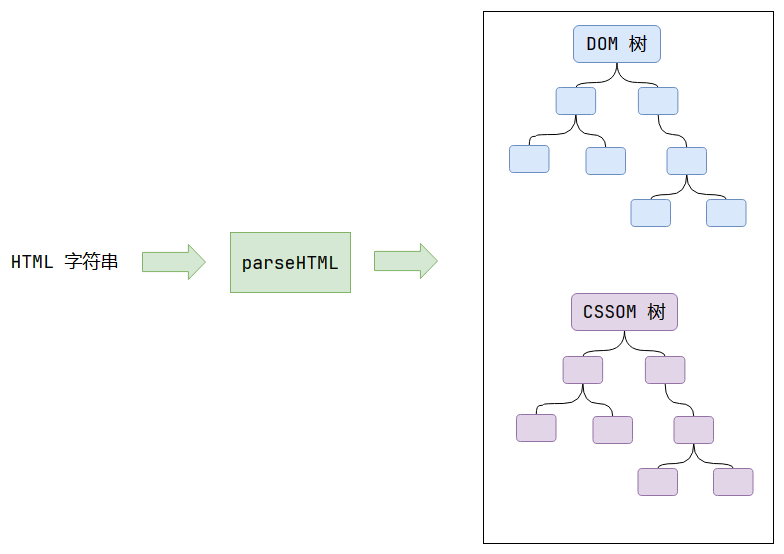
渲染线程通过一系列的解析后会得到一个DOM树，一个CSSOM树
- DOM树(Document Object Model)：页面中的元素和文本，以树形结构相关联。在 JS 代码中，通过document对象可以访问和修改DOM树。而上图中的DOM树指的是浏览器底层由C++生成的DOM树。
- CSS也会被解析成CSSOM（CSS Object Model），也是树形结构，根节点(StyleSheetList)是网页中所有的样式表，二级子节点可能包含内部样式表、外部样式表、内联样式表和浏览器默认样式表（取决于代码中是否有这些内容），如果有两个<link>，则会出现两个外部样式表节点。
### 解析HTMl时碰到css代码怎么办
由于渲染主线程工作量较大，需要另一个线程来帮他处理css代码，此时会启动一个预解析器线程来率先下载解析外部css文件，主线程碰到link标签会跳过处理，等待预解析器下载解析完成后，才进行处理，这样做防止解析css过程中阻塞html的解析，提高渲染效率
- 预解析器 只关注link标签，不关注普通html
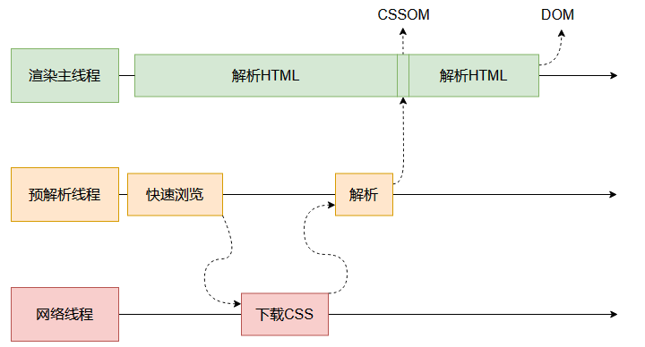
### 解析HTML时碰到js代码怎么办
同样会启动预解析器来下载js文件，但是当主线程碰到script标签时，会停止一切行为，等待js文件下载处理完成后才会进行后续渲染，这也是为什么js会阻塞渲染进程
- 等待的原因为，js文件可能会修改生成的DOM结构树
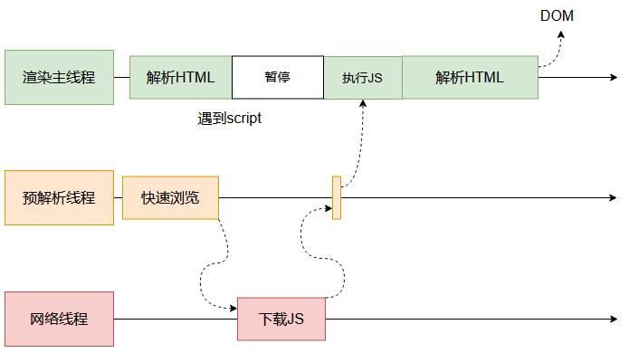

### js访问css内部样式，外部样式，内联样式表
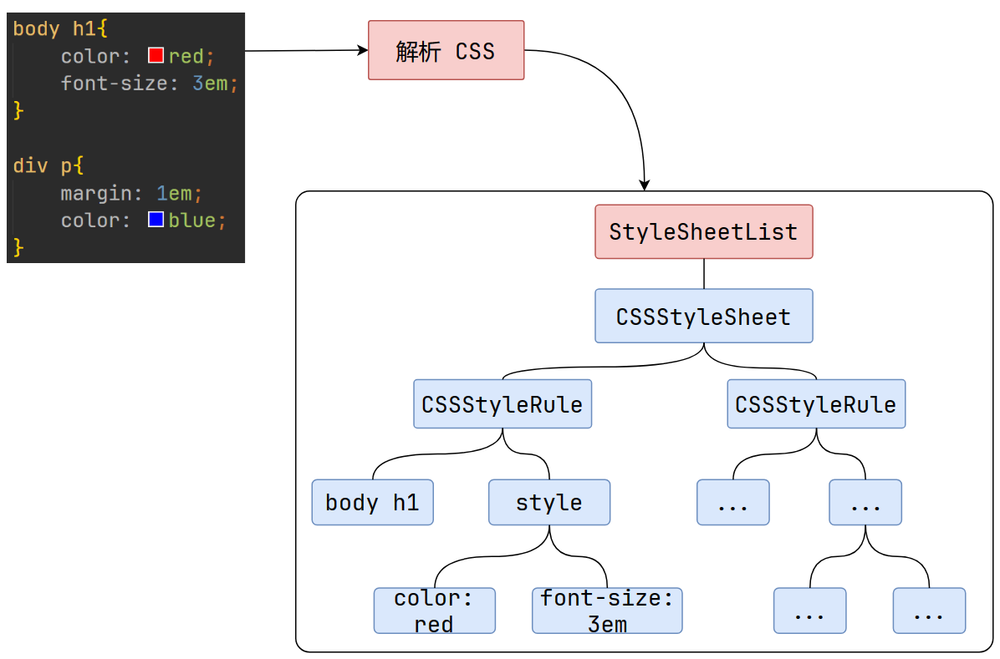
**除了浏览器默认样式表，内部样式表、外部样式表、内联样式表都可以通过 JS 访问到。**

内部样式表和外部样式表：使用document.styleSheets可以访问到一个数组，元素是样式表对象。
**使用document.styleSheets[0].addRule("div", "border: 1px solid red important")可以让页面上的所有div标签的边框变成红色**，这种做法与传统的“获取所有div标签，再设置其style”的做法不同。
**掌握这种方式以后，渲染完成后给多个元素添加样式就无需获取全部样式，进行循环添加**
- styleSheetList 所有内部样式，外部样式集合
- cssStyleSheet 单个样式对象
- cssRules 单个样式对象规则集合
- cssStyleRule 单条样式规则

内联样式表：使用dom.style访问

## 样式计算
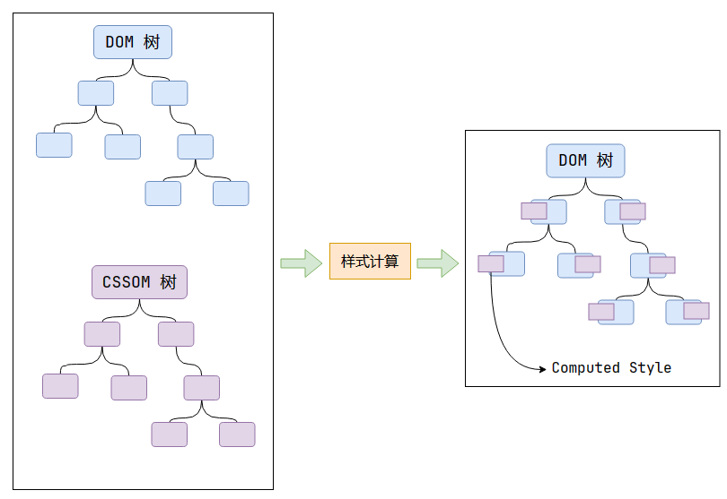
**样式计算过程计算每一个DOM节点的最终样式（Computed Style）。此时的DOM元素都携带了元素的最终样式**

浏览器查看元素的所有属性
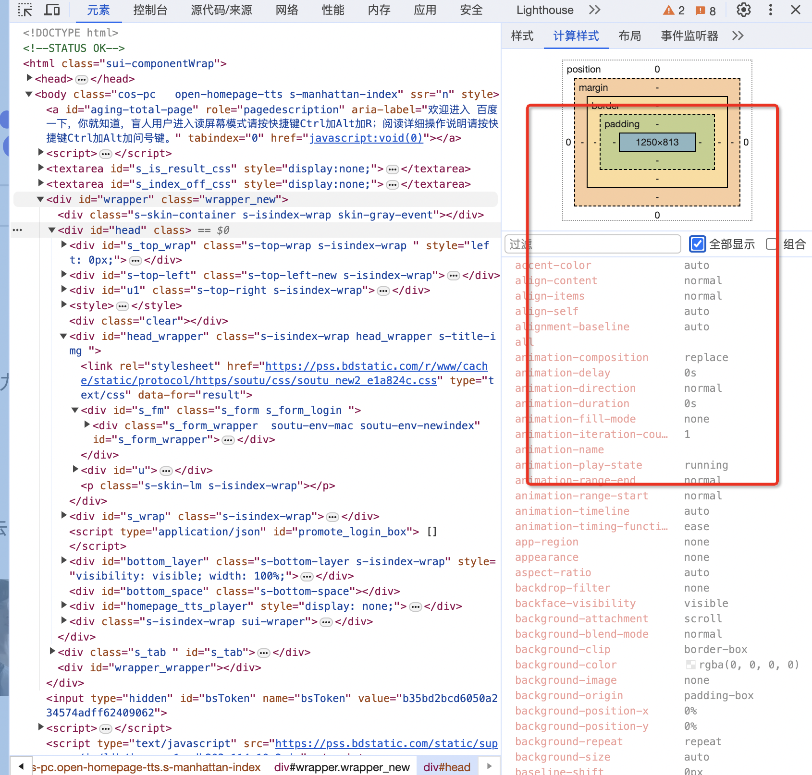
得到的 DOM 树和 CSSOM 树。通过遍历 DOM 树，为每一个 DOM 节点，计算它的所有 CSS 属性。

### 属性计算过程
1. 计算确定声明值，通过**自定义CSS样式**和**浏览器内置的样式表**的声明值相加得到全部的声明值，并且将部分相对值进行转换为绝对值。
- color: red;转换为color: rgb(255, 0, 0);，将font-size: 2em;转换为font-size: 14px;
2. 层叠冲突：在确定声明值时，声明的样式规则发生了冲突。此时会进入解决层叠冲突的流程
- 比较源的重要性 自定义样式 > 浏览器默认样式
- 比较优先级 !important > id > class > 标签 > 继承 > *
- 比较次序  同优先级后声明覆盖前声明
3. 使用继承 对于每一个 DOM 节点，都会去计算它的所有 CSS 属性。对于未声明的属性，并不是直接使用默认值，而是使用继承值。
- 继承原则：就近继承，与权重无关，大部分字体相关的属性都是可继承的，可以在MDN上查找属性是否可继承。
4. 使用默认值

## 布局 layout
此过程将DOM树转换为layout树; 
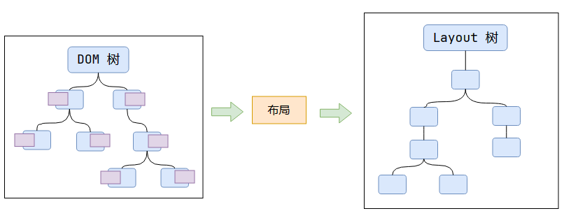
根据 DOM 树里每个节点的样式，计算出每个节点的尺寸和位置。
- 百分比，或者auto，在上一步骤无法算出来，在布局这个过程才能算出来。他的尺寸和位置与他的包含块有关
### 包含块
包含块影响这些内容的计算：width，height，margin，padding，偏移量(position为absolute或fixed的时候)，以及使用百分比的时候，是依照其包含块数值为基准计算的。
#### 确定包含块
- static、relative、sticky：包含块可能由它的最近的祖先块元素的内容区的边缘组成；
- absolute：由它的最近的 position 的值不是 static 的祖先元素的内边距区的边缘组成；
- fixed：在连续媒体的情况下包含块是viewport；
- absolute或fixed：包含块也可能是由满足以下条件的最近父级元素的内边距区的边缘组成的。
  1. transform或 perspective 的值不是 none。
  2. will-change的值是 transform 或 perspective。
  3. backdrop-filter的值不是 none（例如：backdrop-filter: blur(10px);）。
### DOM树与layout树不是一一对应的
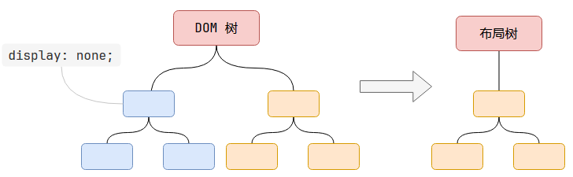
布局树是记录节点的几何信息(尺寸和位置)的，如果设置了display: none;，则节点失去几何信息，不会被添加到布局树中。
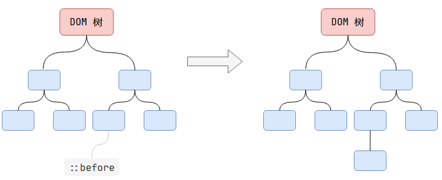
伪元素节点不存在于DOM树中，但是有几何信息，因此会被生成到布局树中。
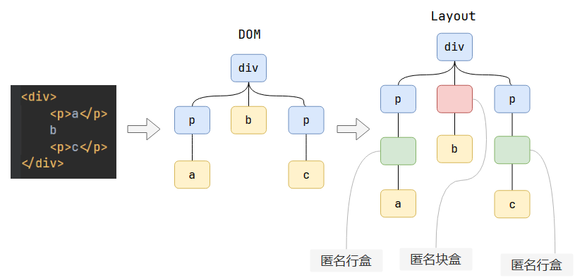
布局过程存在两个规则(w3c规定)：如果在块盒中直接写入内容，则会在中间生成一个匿名行盒；如果块盒和行盒相邻，则为行盒外部生成一个匿名块盒。（参考上图）
- 内容必须在行盒中
- 行盒和块盒不能相邻
### 浏览器默认样式
html标签只表明语义，不区分行盒或块盒，css决定元素是行盒还是块盒。
通常理解的p, div是块盒，是因为浏览器默认样式给它们设置了display: block;。
head，meta等标签都是隐藏的，是因为浏览器默认样式表给它们设置了display: none;。
可以在github上chromium的源代码中找到这些默认样式。

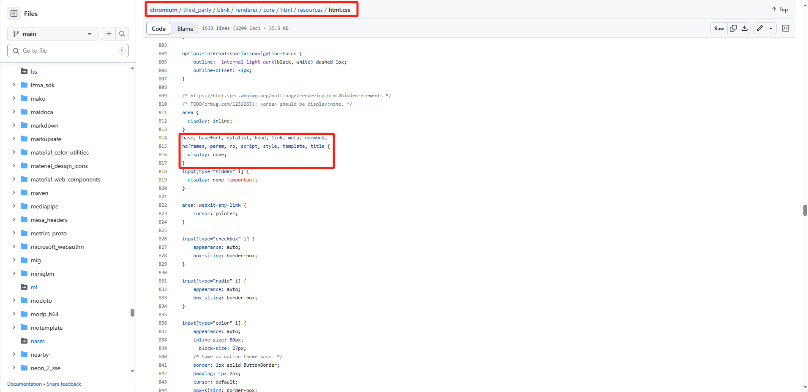

上述的DOM树和布局树都是指浏览器底层的C++对象，它们以不同程度暴露到JS中。
对于DOM树，JS提供了document对象可以访问；而布局树，只暴露出了很少的内容，例如：clientWidth，offsetWidth等属性。

## 分层 layer
现在的页面大多都十分复杂，并且交互效果很多。如果不分层，用户的一个简单交互将导致整个页面的重新渲染，效率低下。
分层的好处在于可以局部的渲染，提高性能。

chrome 查看页面分层情况

通常来说不会太多层，因为分层虽然可以提高渲染效率，但是占用很大内存空间。
分层与部分CSS属性有关，通常页面越复杂则层越多，但是也不一定，因为不同浏览器的分层策略可能不同。
总结：与堆叠上下文有关的属性，会影响分层的决策，最后依据不同浏览器的具体实现，生成分层的结果。
- 与堆叠上下文有关的属性：z-index，opacity，transform......

### will-change
通常大多数元素例如div不会单独分为一层，但是如果它的内容经常需要更新、需要重新渲染，可以添加一个属性：will-change。
如果这个元素的transform属性需要经常发生变化，那么可以声明will-change: transform;，告知浏览器其需要经常更新，但是最后是否决定分层依然是浏览器的具体实现决定的。

## 绘制 paint
需要生成绘制的指令，为每个层生成绘制指令集，用于描述这一层的内容该如何画出来。
- canvas是浏览器将绘制过程封装后提供给开发者的工具。
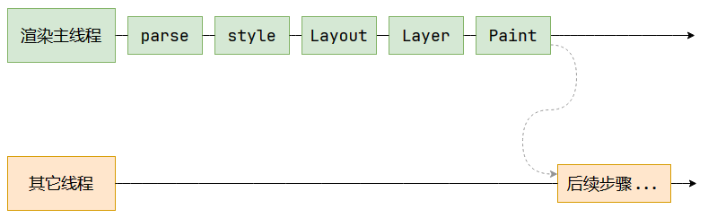
**至此渲染主线程的工作完毕** 
## 分块 Tiling
分块将每一层分为多个小的区域。
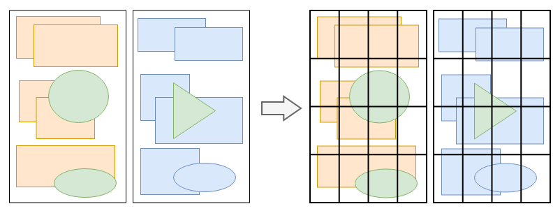
这一步的目的是，优先画出视口内以及接近视口的内容。可以将其视为更底层的“懒加载”。
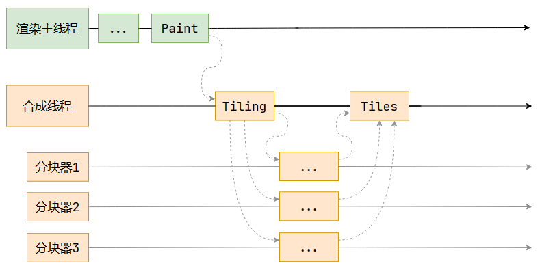
渲染主线程先将分块任务交给合成线程，合成线程会从线程池中拿取多个线程来完成分块工作。
其中的合成线程和渲染主线程都位于渲染进程里。

## 光栅化 raster
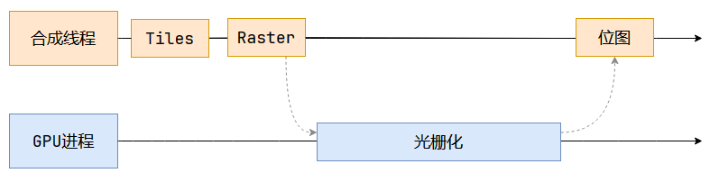
光栅化将每个块变成位图，既然上一步已经分块了，这一步自然是优先处理接近视口的块。
位图：可以简单理解成用二维数组存储的像素信息。
像素信息：例如(red, green, blue, alpha)。
合成线程会将块信息交给GPU进程完成光栅化，而GPU进程内部又会开启多个线程完成光栅化，优先处理靠近视口区域的块

## 画 draw
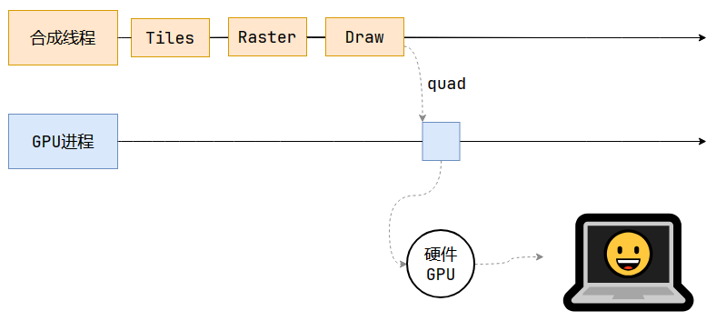
合成线程计算出每个位图在屏幕上的位置，交给GPU进行最终呈现。
其中的quad称为“指引信息”，指明位图信息位于屏幕上的哪一个像素点。
- CSS中的transform是在这一步确定的，只需要对位图进行矩阵变换。这也是transform效率高的主要原因，因为它与渲染主线程无关，这个过程发生在合成线程中。
### 为什么合成线程不直接将结果交给硬件，而要先转交给浏览器GPU？
合成线程和渲染主线程都是隶属于渲染进程的，渲染进程处于沙盒中，无法进行系统调度，即无法直接与硬件GPU通信。
沙盒是一种浏览器安全策略，使得渲染进程无法直接与操作系统、硬件通信，可以避免一些网络病毒的攻击。
综上，合成线程将计算结果先转交给浏览器的GPU进程，再由其发送给硬件GPU，最终将内容显示到屏幕上。


### 什么是 reflow？
reflow 的本质就是重新计算 layout 树。
当进行了会影响布局树的操作后，需要重新计算布局树，会引发 layout。
为了避免连续的多次操作导致布局树反复计算，浏览器会合并这些操作，当 JS 代码全部完成后再进行统一计算。所以，改动属性造成的 reflow 是异步完成的。
也同样因为如此，当 JS 获取布局属性时，就可能造成无法获取到最新的布局信息。
### 什么是 repaint？
repaint 的本质就是重新根据分层信息计算了绘制指令。
当改动了可见样式后，就需要重新计算，会引发 repaint。
由于元素的布局信息也属于可见样式，所以 reflow 一定会引起 repaint。

### 为什么 transform 的效率高？
因为 transform 既不会影响布局也不会影响绘制指令，它影响的只是渲染流程的最后一个「draw」阶段
由于 draw 阶段在合成线程中，所以 transform 的变化几乎不会影响渲染主线程。反之，渲染主线程无论如何忙碌，也不会影响 transform 的变化。