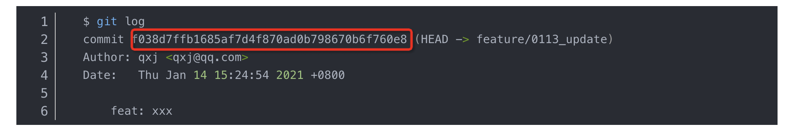
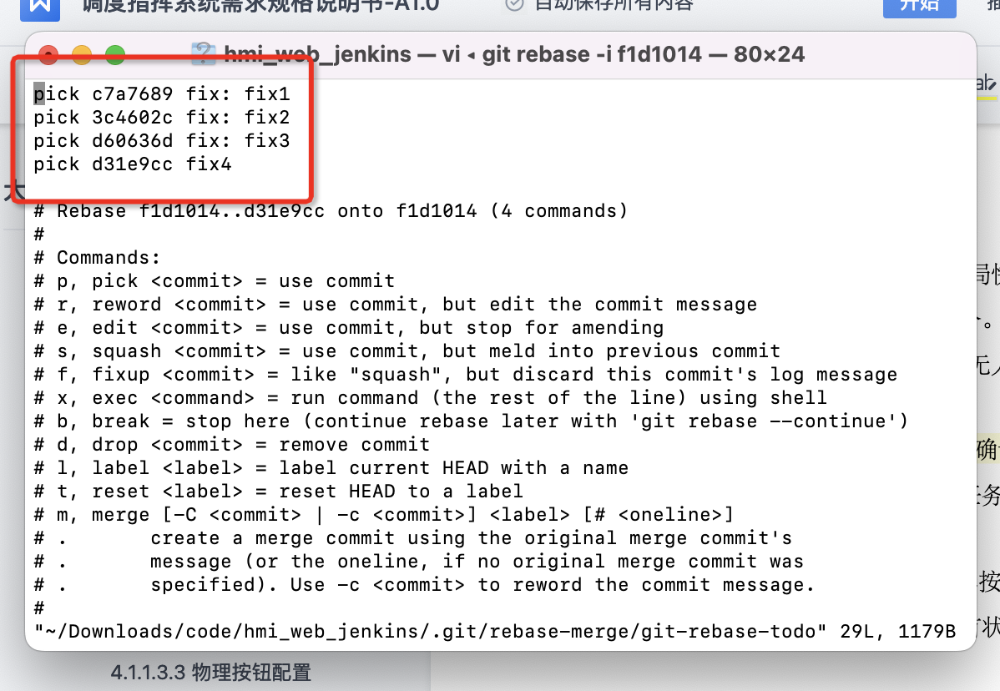
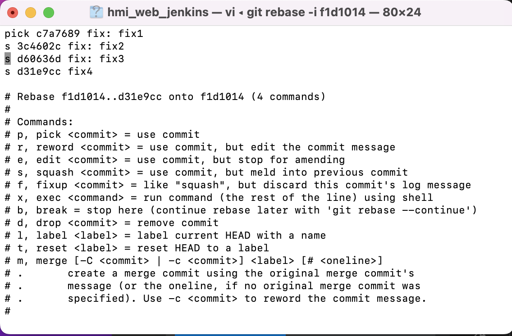
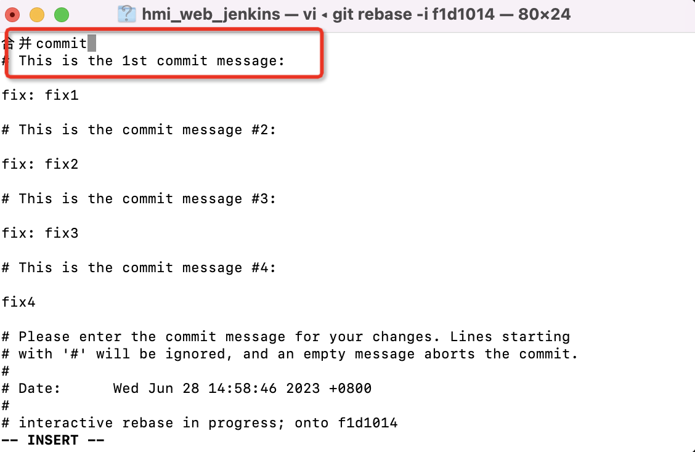
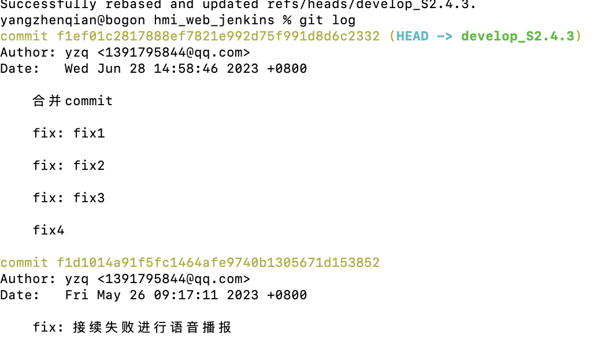

# git

### hash
通过git log 查看提交记录的hash值（只取前7位就可以）
git log --graph  查看log结构图


## git stash 暂存代码
在已经开发了一部分代码，发现分支存在问题需要回退到之前的版本，此时不想删除已开发的代码并回退到之前的版本

### 暂存常用命令
```js
git stash || git stash -m "暂存说明" || git stash save "暂存说明" //暂存文件
git stash list // 查看暂存列表
git stash pop stash@{0} //恢复暂存列表第一个暂存项，并删除暂存记录
git stash apply stash@{0} //恢复暂存列表第一个暂存项，并保存暂存记录
git stash push text.txt main.js //只缓存部分文件 多个文件用空格分隔
git stash show stash@{0}  //查看某次暂存修改文件
git stash show -p stash@{0} //查看某次暂存所有的文件
git stash drop stash@{0} //删除某条暂存
git stash clear // 删除所有暂存
```

## git 生命周期钩子函数
- Git钩子是一组脚本，这些脚本对应着Git仓库中的特定事件，每一次事件发生时，钩子会被触发。这允许你可以定制化Git的内部行为，在开发周期中的关键点上触发执行定制化的脚本。

- git钩子分为本地钩子 & 服务端钩子

- 钩子脚本文件通常放置于项目目录的.git/hooks文件夹下。Git会在初始化项目时自动在这个文件夹下放置一些样例脚本。

- 在指定Git仓库中，钩子都是存在于本地的，它们不会跟随git clone命令被复制到新的仓库中去，所以任何对于当前仓库有权限的人都可以对其进行修改。这个特性对于为开发团队配置钩子产生了深远的影响。常用的如在.git存储钩子脚本，clone项目后手动复制到.git下；

- 本地钩子只会影响本地仓库。想必一定会记得每个开发者自己可以修改本地钩子，所以无法将其作为一种提交规范强制执行。不过它们可以让开发者能够更方便地遵循某种规范。
- 已经封装好的git钩子库 husky， line-staged等库
### 本地钩子
脚本放在本地，每位成员都可以随意修改；
#### pre-commit
每一次执行git commit命令时，在要求填入提交信息或者生成提交对象之前，pre-commit脚本会被触发执行；
pre-commit 脚本退出不为0时，会终止提交流程; 可以执行一些eslint校验 || prettier做代码格式化校验；
```js
// 1 为终止流程 0 为校验通过
if ! git diff-index --check --cached $against
then
    echo "pre-commit: Aborting commit due to whitespace errors"
    exit 1
else
    echo "pre-commit: No whitespace errors :)"
    exit 0
fi
```

#### prepare-commit-msg
它会弹出含有提交信息的文本编辑器。在这一步可以用来修改squash或者merge命令自动生成的提交信息。
prepare-commit-msg钩子倒是允许用户在生成提交信息之后再来编辑它。钩子只是一个方便生成提交信息的脚本，不太适合作为强制提交信息规范。

prepare-commit-msg脚本接受的三个参数如下：
1. 储存提交信息的临时文件名称。你可以直接修改这个文件的内容来改变提交信息。
2. 提交类型。可以是message（-m或者-F选项），template（-t选项），merge（如果本次提交时合并提交），或者squash（如果提交squash了其他提交）
3. 关联提交的SHA1哈希值。仅当使用-c, -C, --amend选项时可传。

#### commit-msg
可以传递的唯一参数是存储提交信息的文件名。可以在这一步做提交信息的校验 & 提交信息不符合规范打回等操作；方便做统一提交信息规范的处理；

```js
    // 不是fix开头抛出错误并退出流程
    if content.startswith('fix'):
        print "commit-msg: ERROR! The commit message must start with fix";
        sys.exit(1)
```

#### post-Commit
该脚本不需要传入参数，而且其退出状态码不会影响提交结果。可以通过git log -1 HEAD获取刚刚的提交内容
该脚本可以在commit完成之后进行消息通知，输出信息等操作；

#### post-checkout
每次执行git checkout命令成功检出一个分支或者提交时触发。用于在切换分支时做一些删除混乱文件的操作；
退出状态码对于流程无影响，可以对一些特殊的分支做单独的处理

接收三个参数
1. 当前的HEAD引用
2. 新的HEAD引用
3. 区分本次checkout是针对分支的还是针对文件的。选项值分别为1和0。

#### pre-rebase

git rebase 之前运行的脚本

该钩子接受两个参数：上游分支，和进行rebase的分支。当rebase的分支为当前分支时，第二个参数为空。钩子脚本退出状态码非0时，退出rebase。
```js
// 禁止所有rebase操作
echo "pre-rebase: Rebasing is dangerous. Don't do it."
exit 1
```

### 远程钩子
服务端的钩子与本地钩子类似，只是他们存在于服务端仓库，这些钩子可以通过拒绝某些提交来强制执行提交规范。

#### pre-receive & update

pre-receive 优先于 update执行，都在修改远程仓库前触发，无法控制开发者本地钩子规范，但可以通过该钩子拒绝不合适的提交；还可以做权限校验，判断推送人是否有权限往该分支上推送消息；
pre-receive 与 update不同点，同时触发多个推送，pre-receive只执行一次，而update则执行多次，方便对每条提交进行单独校验；

#### post-receive

提交代码合入主仓库成功后触发，主要用于消息通知，发送邮件，重新编译等操作；

## git cherry-pick 部分commit提交

当需要合并其他分支代码，可以直接使用merge，但如果不想全部合并，只想合并他的某几个commit提交，可以使用cherry-pick进行commit合并

merge合并最小单位是分支， cherry-pick 最小单位是commit记录

```js
// 以下branch1为待合并的分支，branch2为要进行合并的分支
git checkout branch1  //切换为branch1
git log // 查看提交记录，并找到自己需要合并的commit记录 Hash值

git checkout branch2 //切换为branch2
git cherry-pick hash //将branch1单个hash合并到branch2

//一次合并多个commit提交,中间用空格间隔
git cherry-pick hash1 hash2

//进行连续一段commit记录进行合并,下面的命令从hash1到hash2的（左开右闭，不包含hash1）所有提交。
//必须按照先后顺序，否则会失败，但不会报错
git cherry-pick hash1..hash2
//如果想要包含hash1,则增加^号，或选择他前一个hash值
git cherry-pick hash1^..hash2

```

git cherry-pick 常用配置项
- -e: 打开编辑器
- -n: 只更新工作区&暂存区，不产生新的提交记录
- -x: 保留原来提交信息，方便后续排查提交怎么产生的
- -s: 追加操作者账户名，方便追查谁进行的操作
- -m: 如果原提交是两个分支的合并，则需要传入该参数，否则会失败

冲突解决与merge一致

## git reset 回退版本

当代码上传到暂存区，发现存在问题，需要重新修改进行提交

传参hash值均为想要回退的commit的上一条hash
#### --mixed
```js
// mixed 作为reset默认值，可以不传，删除commit提交记录，工作区不受影响
// 暂存区代码回退到未add状态，可修改后再次add, commit提交
git reset --mixed hash
```

#### --soft
```js
// soft删除commit提交记录，工作区不受影响
// 暂存区代码回退到已add，未commit状态，可再次commit提交
git reset --soft hash
```

#### --hard
```js
// hard删除commit提交记录，工作区 & 暂存区都会被删除
git reset --hard hash
```

## git revert 撤销中间某次commit提交

当提交了多次commit，此时想要把中间的commit内容撤销，又不影响后面的commit提交

```js
// 进行某个commit的撤销，会将该次commit提交撤销到add的状态
git revert -n hash
// 重新commit提交
git commit -m 'revert hash'
//此时暂存区已将revert的commit提交删除，并重新生成了hash
```

## git rebase 变基

 merge 是将一个分支的更改合并到另一个分支中。它会创建一个新的合并提交，将两个分支的更改合并在一起。合并提交会保留每个分支的历史记录，并且可以在合并后的分支上看到合并的结果。 
 
 rebase 则是将目标分支的提交作为当前分支的基线；会更改提交历史，是提交记录看起来更加线性，缺点：会导致提交记录混乱，先后顺序更改，导致后续追查问题困难；

```js
// 将目标分支的最新提交作为当前分支的基线
git rebase 目标分支
```

### 多个commit合并

当开发一个需求完毕需要合并主分支时，需求存在多个commit提交记录，为了防止过多的commit提交导致主分支记录混乱，可以先将多个commit合并为一个commit，再进行merge
```js
git log // 查看提交记录，选择需要合并的commit
git rebase -i hash // -i为不需要合并的hash，hash取值为需要合并的第一个提交记录
git rebase HEAD~n // n为前n个提交记录
```
##### 进入vi编辑模式


##### 找到需要合并的commit将pick修改为s || squash 将本commit合并到前一个commit


#### 配置项及作用

- pick: 保留commit
- reword: 保留commit，但需修改message信息
- edit： 保留commit，但需修改提交信息
- squash: 将该commit合并到前一个commit
- fixup: 将该commit合并到前一个commit，但不要保留该提交的注释信息
- exec: 执行shell命令
- drop: 删除commit

#### 输入合并后的提交信息



#### 合并成功后的log



#### 直接运行 git push -f，重新拉取代码会导致合并无效


#### rebase还可修改已经提交的commit信息等其他操作

#### 如果这个过程中有操作错误，可以使用 git rebase --abort来撤销修改，回到没有开始操作合并之前的状态。

### git diff 查看commit更改
```js
git diff HEAD~3
```