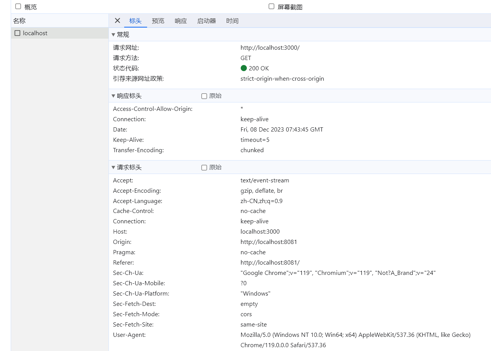
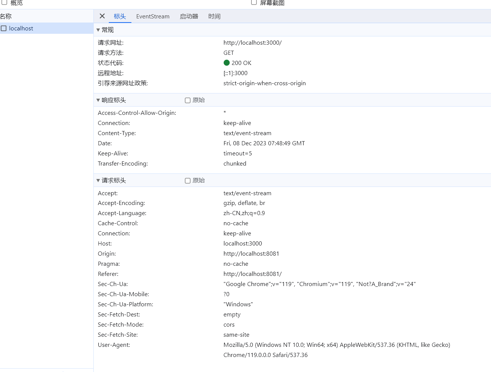

# EventSource

## 简介
server-sent events（缩写SSE）。EventSource 基于http协议的单向通信。IE兼容解决的办法: npm install event-source-polyfill。可以自动重连接；

## 使用场景
* 数据监控
* IM及时聊天
* 消息推送
* chatgpt使用EventSource来进行消息实时通信的


### EventSource 优势
* 简单易用：EventSource API非常简单，易于使用和理解。
* 服务器推送：EventSource适用于服务器主动向客户端推送数据，客户端只能接收服务器发送的事件。
* 自动重连：EventSource会自动处理连接断开和重新连接的情况，适用于长期保持连接并接收事件流的场景。
* 兼容性：EventSource在大多数现代浏览器中得到支持。
### EventSource 劣势
* 单向通信: 只支持服务端到客户端的推送
* 数据限制: 不支持二进制数据，只支持普通的文本数据
### 普通HTTP请求与EventSource请求对比
1. EventSource请求返回结果不在Response选项，取而代之的是EventStream；
2. EventSource请求头 Content-Type设置为 text/event-stream；

* 普通请求图

* EventSource请求图

## EventSource 使用

* 关闭链接
   1. 客户端监听error事件关闭链接
   2. 服务端发送特定的event事件关闭链接 
   3. 客户端不触发close关闭，服务端触发关闭会造成重连
### 服务端配置

```js
const http = require('http')
http.createServer((req, res) => {
    res.writeHead(200, {
        'Content-Type' : 'text/event-stream', //设置header头
        'Access-Control-Allow-Origin':'*'
    })
    const timer = setInterval(()=>{
        const date = {date:new Date()}
        var content = 'event: data\n'+"data:"+JSON.stringify(date)+"" + "\n\n";
        res.write(content); //正常发送信息
    },5000)
    res.end(); //主动关闭链接
    // 监听客户端关闭
    res.connection.on("close", function(){
        res.end();
        clearInterval(timer);
        console.log("Client closed connection. Aborting.");
        });
 
}).listen(3000)

```

### 客户端配置
```js
// 建立EventSource链接
let server = new EventSource("http://localhost:3000");
// 监听对应的消息
server.addEventListener('data', (ev) => {console.log(ev, 'add')})
  server.close();
// 无法监听服务端/客户端关闭
// server.addEventListener('close', () => {
//   console.log(1234);
// })
// server.onclose = () => {
//   console.log(123);
// }
// setTimeout(() =>{server.close()},5000)

// 使用error事件监听服务端关闭
server.addEventListener('error', (ev) => {
  console.log(ev);
  server.close();
})
// 监听消息开启
server.addEventListener('open', (ev) => {
  console.log(ev);
})

```
### chatgpt为什么选择eventSource
* 服务器推送：EventSource专注于服务器向客户端主动推送事件的模型，ChatGPT作为一个长期运行的服务，当有新的回复时，服务器可以主动推送给客户端，而不需要客户端频繁发送请求。
* 自动重连和错误处理：EventSource具有内置的自动重连机制，它会自动处理连接断开和重新连接的情况。这对于ChatGPT对话而言很重要，因为对话可能需要持续一段时间，连接的稳定性很重要。
* 简单性和易用性：相对于WebSocket，EventSource的API更加简单易用，只需实例化一个EventSource对象，并处理服务器发送的事件即可。这使得开发者可以更快速地实现对话功能;
* 广泛的浏览器支持：EventSource在大多数现代浏览器中得到广泛支持，包括移动端浏览器。相比之下，WebSocket在某些旧版本的浏览器中可能不被完全支持，需要考虑兼容性问题。

### 总结
EventSource 是 HTML5 中一个强大的 API，提供了简单可靠的服务器推送机制，用于实现实时通信。

与 WebSocket 相比，EventSource 的优势在于其简单易用、自动重连、轻量级和跨域支持。然而，它也有一些限制，如单向通信和较低的浏览器支持。相比之下，WebSocket 适用于双向通信、大规模应用和实时性要求较高的场景，但其复杂性和穿越防火墙的挑战也需要考虑。

总的来说，EventSource 是一种非常有用的 API，适用于许多实时应用场景，如实时股票报价、即时聊天、实时通知等。它提供了一种简单而可靠的方式来建立服务器推送连接，并实现实时更新和通知。如果应用程序只需要服务器向客户端单向推送数据，EventSource 是一个不错的选择。然而，如果需要双向通信或更高级的实时功能，WebSocket 可能更适合。