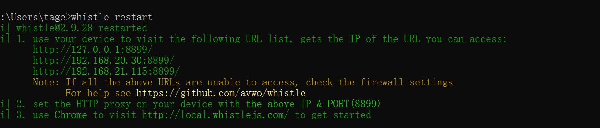
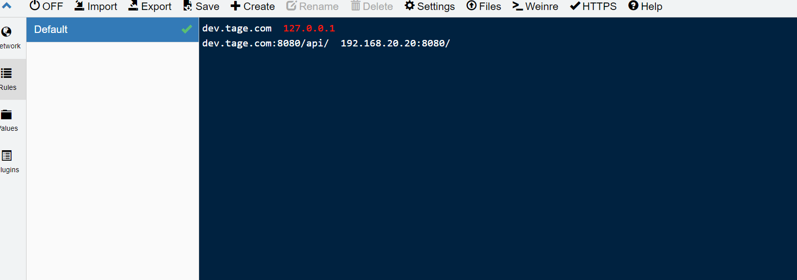
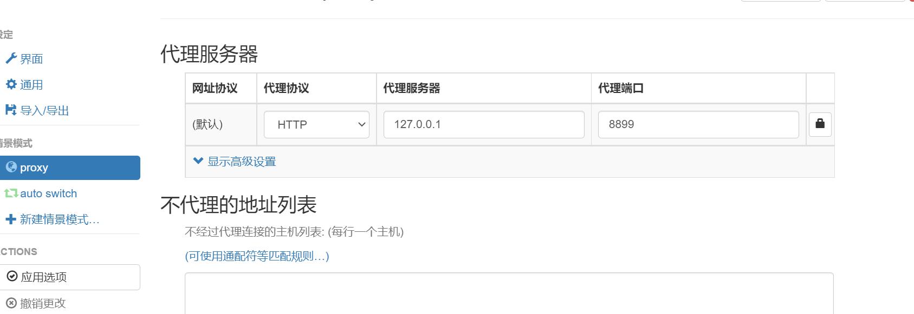
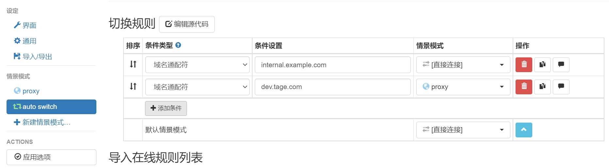

# 前端代理解决方案

**whistle + 谷歌插件 proxy SwitchOmega**

**whistle**

**whistle 安装    npm i -g whistle**

**whistle 启动  whistle start**

浏览器访问 **127.0.0.1:8899**

将需要代理的域名写入到rules选项中，可以创建多个文件

newWork可以查看所有代理的请求

**proxy SwitchOmega**

下载解压拖入扩展程序自动安装 （自己百度下载）

proxy选项配置为 127.0.0.1:8899(whistle服务)

auto switch  将需要代理的域名 指向proxy ，不需要代理的直连

