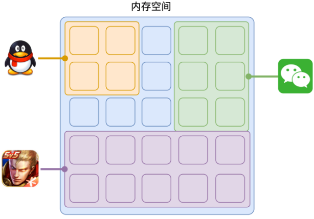
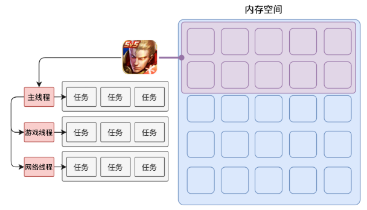
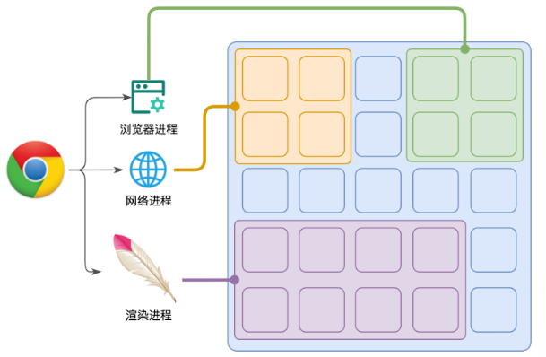
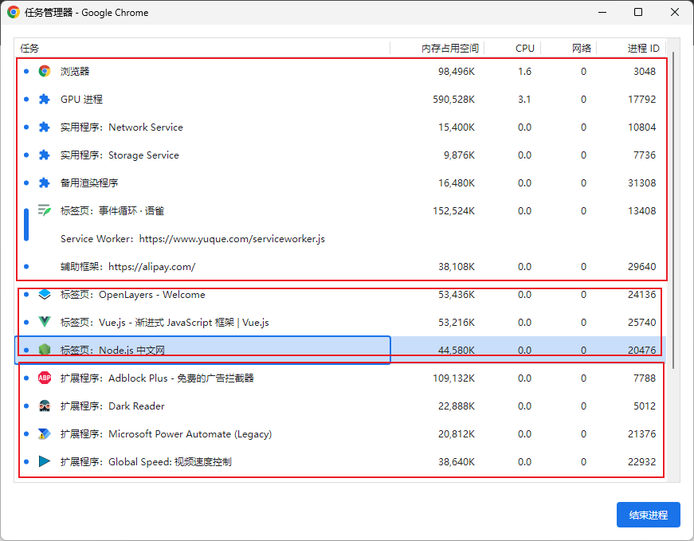
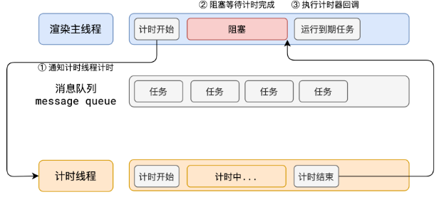
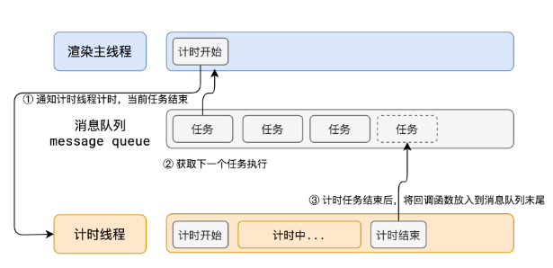

# 事件循环机制（event loop）

## 进程

每个程序在运行时都需要有它自己专属的内存空间，我们可以简单的把这块内存空间理解为进程。每一个应用都至少有一个进程，可以启动多个进程，进程之间是相互独立的，即使要通信，也需要双方的同意。


## 线程
线程可以理解为进程下面的孩子，上面说的一个程序只要有一个进程，所以在进程开启后会自动创建一个线程来运行代码，该线程称之为主线程。
如果程序需要同时执行多块代码，主线程就会启动更多的线程来执行代码，所以一个进程中又可以包含多个线程。


## 浏览器有那些进程与线程
浏览器在运行时为了避免相互影响，减少奔溃的几率，当启动浏览器后，他会自动启动多个进程。
浏览器程序运行时，会启动浏览器主进程，而网络进程，渲染进程等由浏览器进程启动


可以打开浏览器的任务管理器查看当前的所有进程。

其中，最主要的进程有：

**浏览器进程：**

**主要负责界面显示、用户交互、子进程管理等。浏览器进程内部会启用多个线程处理不同的任务。**

**网络进程:**

**负责加载网络资源。网络进程内部会启动多个线程来处理不同的网络任务。**

**渲染进程:**
- **当前每一个标签页启动一个渲染进程，如果打开标签页较多，进程也会相应增加，后续chrome将做出优化，每一个域名一个进程，多个标签页同一个域名将共享一个进程**
- **渲染进程启动后，会开启一个渲染主线程，主线程负责执行HTML、CSS、JS代码。**
- **默认情况下，浏览器会为每个标签页开启一个新的渲染进程，以保证不同的标签页之前不相互影响。**
- **事件循环就是在这个进程内执行的**
## js同步/异步

### 异步
在代码执行过程中，会遇到一些无法立即处理的任务，比如：
- 计时完成后需要执行的任务--setTimeout、setInterval
- 网络通信完成后需要执行的任务 -- XHR、Fetch
- 用户操作后需要执行的任务 -- addEventListener
- 如果让渲染主线程等到这些任务的时机达到，就会导致主线程长期处于【阻塞】状态，从而导致浏览器【假死】



**但是渲染主线程就是浏览器和用户交互的任务，它承担着极其重要的任务，它无论如何都不能阻塞！**

所以，浏览器选择异步来解决这个问题，如下图所示，当遇到一个计时任务时，会立即开启一个计时线程，然后紧接着执行消息队列的下一个任务，当计时器结束后将回调函数放入消息队列末尾，依次排序进入渲染主线程中。

**使用异步的方式，渲染主线程用不阻塞**



**总结**
- 单线程是异步产生的原因
- JavaScript是一门单线程的语言，因为他运行在浏览器的渲染主线程中，而渲染主线程只有一个。而渲染主线程承担着诸多的任务，如渲染页面、执行JS都在其中运行。
- 如果使用同步的方式，就既有可能导致主线程产生阻塞，从而导致消息队列中很多其他任务无法得到执行。一方面导致繁忙的主线程白白消耗时间，另一方面导致页面无法及时更新，给用户造成页面卡死现象。
- 所以浏览器采用异步的方式来避免。具体做法时当某些任务发生时，比如计时器、网络、事件监听。主线程任务交给其他线程去处理，自身立即结束任务的执行，转而执行后续代码。当其他线程完成时，将事先传递的回调函数包装成任务，加入到消息队列的末尾排队，等到主线程调度执行。在这种异步模式下，浏览器用不阻塞，从而最大限度的保证了单线程的流畅运行。

## 事件循环解决的问题

事件循环又称为消息循环，在chrome中称为（message loop），主要是解决js单线程阻塞问题，是js异步的实现方式

## js 内存机制

js 具有自动垃圾回收机制,所以对于前端开发来说,内存空间并不是一个经常被提及的概念

在 js 中,每一个数据都需要一个存储空间.内存空间又分为两种: **栈内存(stack)与堆内存(heap)**

## 栈与堆

### 栈

**栈内存一般存储基础数据类型**

- Number
- String
- Boolean
- Symbol
- null
- undefined

```js
var a = 1;
```

定义一个变量 a,系统自动为我们分配存储空间.我们可以直接操作保存在栈内存空间的值,因此技术数据类型都是`按值访问`

### 堆

**堆内存一般存储引用数据类型**

- Object
- Array
- Function(**函数的主体内容存在于堆中,但函数的引用地址是存在栈中的,函数执行的时候在栈里执行**)
- Date
- ...

```js
// 变量a存在于栈中,{ name: 'xuhairui' }作为对象存在于堆内存中
var a = { name: 'xuhairui' };

// 变量b存在于栈中,[1, 2, 3]作为对象存在于堆内存中
var b = [1, 2, 3];
```

所以当要访问堆内存中的引用数据类型时,实际上是`先从栈中获取了该对象的地址引用(或者地址指针)`,然后`再从堆内存中取得我们所要的数据`

```js
var m = { a: 10, b: 20 };
var n = m;
n.a = 15;
console.log(m.a); // 15
```


### 总结

栈:

- 存储基本数据类型
- 按值访问
- 存储的大小固定
- 由系统自动分配内存空间
- 空间小,运行效率高
- **先进后出,后进先出**(队列是先进先出)
- 栈中的 DOM，ajax，setTimeout 会依次进入到队列中,当栈中代码执行完毕后，再将队列中的事件放到执行栈中依次执行
- 微任务与宏任务

堆:

- 存储引用数据类型
- 按引用访问
- 存储的值大小不定,可动态调整
- 主要用来存放对象
- 空间大,但是运行效率相对较低
- 无需存储,可根据引用直接获取

## 浏览器循环事件

**事件循环又称为消息循环，是渲染主线程的工作方式；
在chrome源码中，渲染主线程启动时会启动一个无限循环的for，每次循环依次从消息队列内取出第一个任务执行，而其他线程只需要在合适的时机将任务加入到对应的队列末尾即可**

JavaScript 代码的执行过程中，除了依靠函数调用`栈`来搞定函数的执行顺序外，还依靠任务队列(task queue)来搞定另外一些代码的执行。整个执行过程，我们称为事件循环过程。一个线程中，事件循环是唯一的，但是任务队列可以拥有多个。任务队列又分为 macro-task（宏任务）与 micro-task（微任务），在最新标准中，它们被分别称为 task 与 jobs。

**目前两种队列已无法满足复杂的浏览器环境，W3C 不再使用宏队列的说法，根据W3C的最新解释**
- **任务是没有优先级之分，每个任务都有一个任务类型，同一个类型的任务必须在一个队列，不同类型的任务可以分属于不同的队列。在一次事件循环中，浏览器可以根据实际情况从不同的队列中取出任务执行。**
- **浏览器必须准备好一个微队列，微队列中的任务优先所有其他任务执行HTML Standard**

**在目前 chrome 的实现中，至少包含了下面的队列：**
- **延时队列：用于存放计时器到达后的回调任务，优先级「中」**
- **交互队列：用于存放用户操作后产生的事件处理任务，优先级「高」**
- **微队列：用户存放需要最快执行的任务，优先级「最高」**

### 宏任务

宏任务大致包括：

- script（整体代码）
- setTimeout
- setInterval
- setImmediate
- I/O
- UI render

### 微任务

微任务大致包括：

- process.nextTick
- Promise
- Async/await（实际就是 promise）
- MutationObserver(html5 新特性)

流程图大致如下：


总结：执行宏任务，然后执行宏任务产生的微任务，若微任务在执行过程中产生新的微任务，则继续执行新产生的微任务，所有的微任务执行完毕后，再回到宏任务中进行下一轮循环。例如：

```javascript
console.log('script start');
async function async1() {
  await async2();
  console.log('async1 end');
}
async function async2() {
  console.log('async2 end');
}
async1();
setTimeout(function () {
  console.log('setTimeout');
}, 0);
new Promise((resolve) => {
  console.log('Promise');
  resolve();
})
  .then(function () {
    console.log('promise1');
  })
  .then(function () {
    console.log('promise2');
  });
console.log('script end');
```

执行结果

```
script start
async2 end
Promise
script end
async1 end
promise1
promise2
setTimeout
```

执行过程:

- 执行过程,输出"script start";
- 执行 async1(),调用 async2(),输出"async2 end",将console.log(async1 end) 放入微队列中;
- 遇到 setTimeout 函数,放入到宏任务中;
- 执行 Promise,输出"Promise",遇到.then,产生第一个微任务;
- 输出"script end";
- 当前宏任务执行完毕,开始执行当前宏任务产生的微任务,输出async1 end, 输出"promise1",遇到.then,产生新的微任务;
- 执行新产生的微任务,输出"promise2";
- 最后执行下一个宏任务,输出"setTimeout"

Async/await 执行顺序:

- 如果 await 后面直接跟的一个一个变量,如 await 1,这种情况相当于直接把 await 后面的代码注册为一个微任务;

- 如果 await 后面跟的是一个异步函数的调用,如下面的例子:

  ```javascript
  console.log('script start');
  async function async1() {
    await async2();
    console.log('async1 end');
  }
  async function async2() {
    console.log('async2 end');
    return Promise.resolve().then(() => {
      console.log('async2 end1');
    });
  }
  async1();
  setTimeout(function () {
    console.log('setTimeout');
  }, 0);
  new Promise((resolve) => {
    console.log('Promise');
    resolve();
  })
    .then(function () {
      console.log('promise1');
    })
    .then(function () {
      console.log('promise2');
    });
  console.log('script end');
  ```

  那么最后打印的值依次为:

  ```
  script start
  async2 end
  Promise
  script end
  async2 end1
  promise1
  promise2
  async1 end
  setTimeout
  ```

## node 事件循环

node 中也有宏任务和微任务

### 宏任务

- setTimeout
- setInterval
- setImmediate
- script(整体代码)
- I/O 操作等

### 微任务

- process.nextTick()
- new Promise().then(回调)等

#### node 的事件循环的阶段顺序为：

输入数据阶段(incoming data)->轮询阶段(poll)->检查阶段(check)->关闭事件回调阶段(close callback)->定时器检测阶段(timers)->I/O 事件回调阶段(I/O callbacks)->闲置阶段(idle, prepare)->轮询阶段...

#### timers 阶段的执行时机变化

```js
setTimeout(() => {
  console.log('timer1');
  Promise.resolve().then(function () {
    console.log('promise1');
  });
}, 0);
setTimeout(() => {
  console.log('timer2');
  Promise.resolve().then(function () {
    console.log('promise2');
  });
}, 0);
```

- 如果版本是 node11+,一旦执行一个阶段里的一个宏任务就立刻执行微任务队列,这就跟浏览器端运行一致,最后的结果为:

  ```
  timer1
  promise1
  timer2
  promise2
  ```

- 如果版本是 node10 及以前,得看第一个定时器执行完,第二个定时器是否在完成队列中

  - 如果第二个定时器还未在完成队列中,最后的结果为:

    timer1=>promise1=>timer2=>promise2

  - 如果第二个定时器已经在完成队列中,最后的结果为:

    timer1=>timer2=>promise1=>promise2

总结: 如果是 node11 版本一旦执行一个阶段里的一个宏任务(setTimeout,setInterval 和 setImmediate)就立刻执行对应的微任务队列。

## node 和浏览器 EventLoop 的主要区别

两者最主要的区别在于浏览器中的微任务是在每个相应的宏任务中执行的，而 nodejs 中的微任务是在不同阶段之间执行的。

## JS中的定时器能做到精确计时吗？为什么？
- 操作系统的计时函数本身就有少量偏差，由于JS的计时器最终调用的是操作系统的函数，也就携带了这些偏差
- 按照W3C的标准，浏览器实现计时器时，如果嵌套层级超过5层，则会带有4毫秒的最少时间，这样在计时的时间少于4毫秒时又带来了偏差
- 受事件循环的影响，计时器的回调函数只能在主线程执行完同步任务与优先级高的任务后才执行，所以会有一定的偏差

## 解释事件循环

- 事件循环又称为消息循环，是渲染主线程的工作方式；
- 在chrome源码中，渲染主线程启动时会启动一个无限循环的for，每次循环依次从消息队列内取出第一个任务执行，而其他线程只需要在合适的时机将任务加入到对应的队列末尾即可
- 过去将任务队列简单的分为宏队列与微队列，目前两种队列已无法满足复杂的浏览器环境，W3C 不再使用宏队列的说法，取而代之的是一种更加灵活多变的方式
- 根据W3C的最新解；任务是没有优先级之分，每个任务都有一个任务类型，同一个类型的任务必须在一个队列，不同类型的任务可以分属于不同的队列。在一次事件循环中，浏览器可以根据实际情况从不同的队列中取出任务执行。浏览器必须准备好一个微队列，微队列中的任务优先所有其他任务执行

## 解释异步

- 单线程是异步产生的原因，事件循环是异步的实现方式
- JavaScript是一门单线程的语言，因为他运行在浏览器的渲染主线程中，而渲染主线程只有一个。而渲染主线程承担着诸多的任务，如渲染页面、执行JS都在其中运行。
- 如果使用同步的方式，就既有可能导致主线程产生阻塞，从而导致消息队列中很多其他任务无法得到执行。一方面导致繁忙的主线程白白消耗时间，另一方面导致页面无法及时更新，给用户造成页面卡死现象。
- 所以浏览器采用异步的方式来避免。具体做法时当某些任务发生时，比如计时器、网络、事件监听。主线程任务交给其他线程去处理，自身立即结束任务的执行，转而执行后续代码。当其他线程完成时，将事先传递的回调函数包装成任务，加入到消息队列的末尾排队，等到主线程调度执行。在这种异步模式下，浏览器用不阻塞，从而最大限度的保证了单线程的流畅运行。
