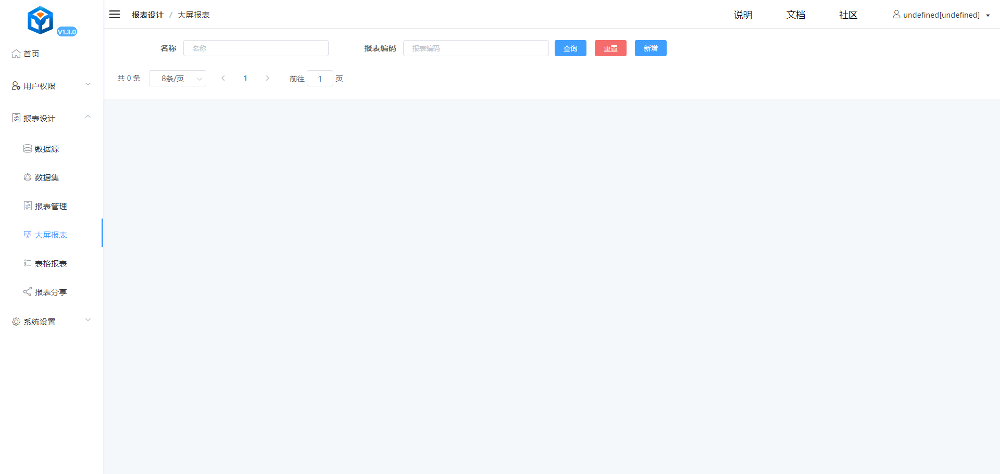
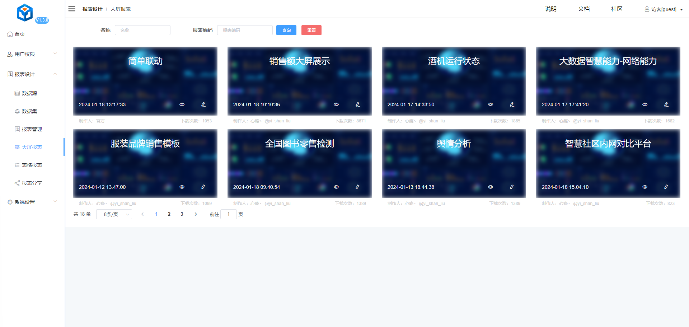
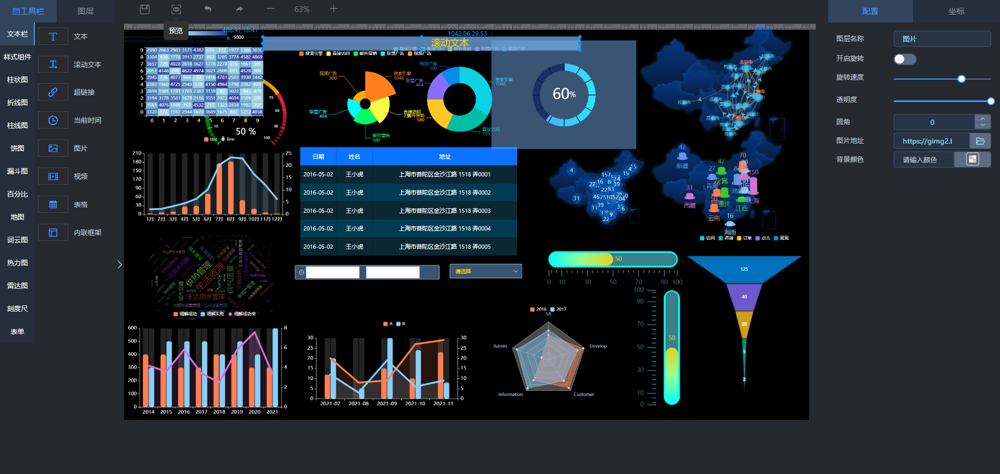
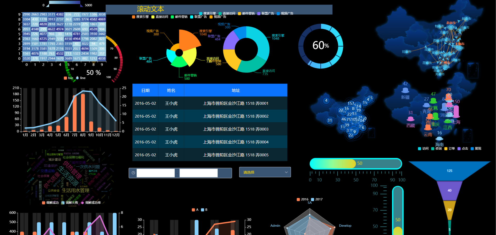
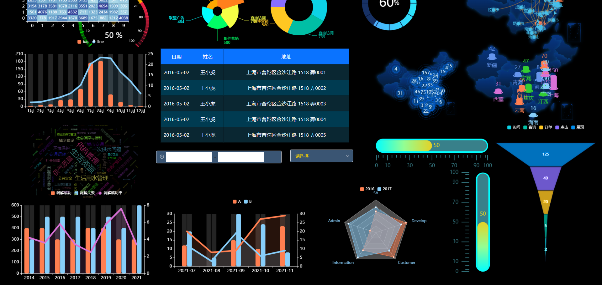

# aj-report 

- 四个项目比较（superset，matebase， aj-report， v6-dooring）
- v6-dooring，superset，matebase： 项目整体偏大，功能较多，造成功能冗余，技术栈为react
- 最终选定aj-report：项目整体较小，功能能够满足需求，技术栈为vue2
## aj-report  前端大屏拖拽生成
- 在线体验：https://ajreport.beliefteam.cn/index.html 体验账号：guest 密码：guest
- 在线文档：https://ajreport.beliefteam.cn/report-doc/
- gitee地址: https://gitee.com/anji-plus/report   
- github地址：https://github.com/anji-plus/report
- 项目技术栈：vue2 + webpack + vuex
## 项目本地运行展示
- 已经生成的大屏列表，支持编辑，预览，新增等

- 大屏报表设计页面

- 大屏报表预览页面

