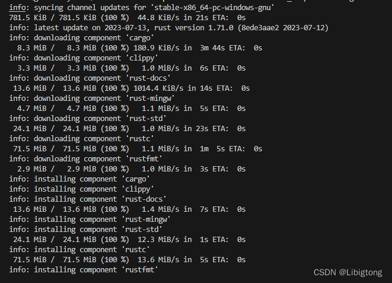
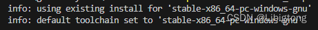

# rust
### 解决rust启动报错 link.exe

1. **不依赖vs（VisualStudioSetup 2017 版本及以后）解决办法**

rustup toolchain install stable-x86_64-pc-windows-gnu 

rustup default stable-x86_64-pc-windows-gnu

2. **依赖vs解决办法**

安装vs 2017以后的版本

配置环境变量

### 离线文档
每当您在板条箱中工作时，cargo doc --open都会为您的项目及其所有依赖项生成正确版本的文档，并在浏览器中打开它。添加标记--document-private-items以也显示未标记的项目pub。

### rustc 命令行参数及作用

-h/--help: 显示帮助信息

-cfg/--configure the compilation environment: 配置编译环境
- 该值可以是单个标识符，也可以是由 = 分隔的两个标识符。
- --cfg 'verbose' or --cfg 'feature="serde"'

-L