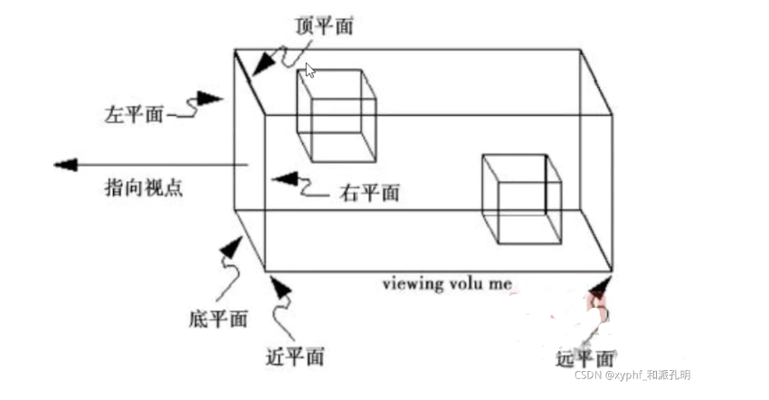
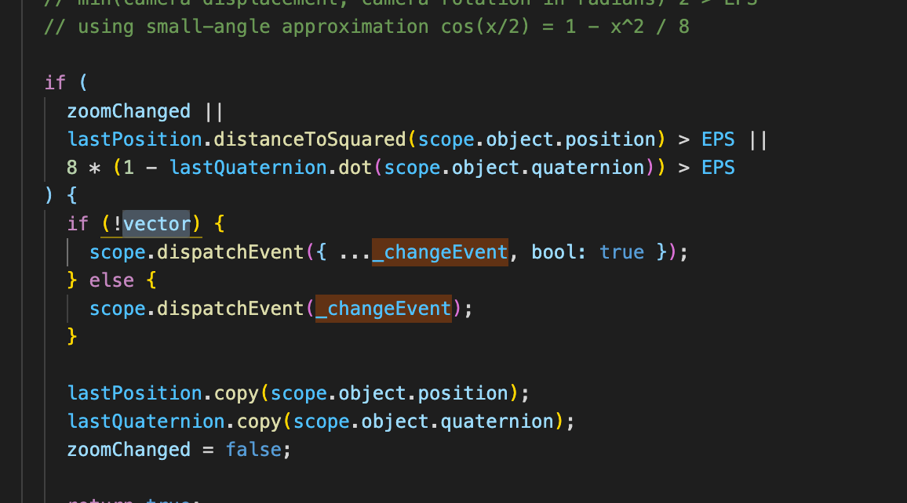
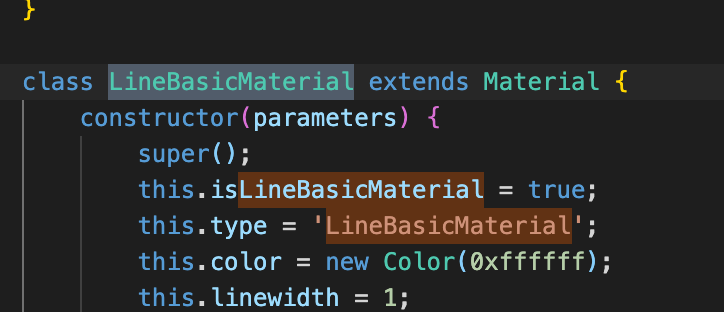

# threejs

## WebGL是什么？

WebGL是一种三维绘图标准，该绘图标准允许把js和openGl结合在一起，这样Web开发人员就可以借助硬件在浏览器中更流畅的展示三维模型和模型， 以创建复杂的导航和数据视觉化；

## threejs是什么？

threejs是一款基于原生WebGL的三维引擎框架（库）, 该框架在WebGL的API基础上以简单，直观的方式封装了三维图形的常用对象，因此大大减少了程序员在Web前端开发三维图形应用的工作量，threejs还使用了很多图形引擎的高级技巧，极大的提高了应用性能；

## 本地运行threejs官网项目
本地运行可访问官网实例 & 文档，避免每次查询问题需访问官网，官网处于外网，访问过慢的问题
- github地址  https://github.com/mrdoob/three.js
- git克隆仓库地址  https://github.com/mrdoob/three.js.git
- 文件目录
  - examples 官网实例文件
  - docs 官网文档文件
下载项目
- 下载npm包 http-server 作用：在某文件下面生成可访问的链接（默认端口8080）；
- 运行
  - 进入某文件夹下运行http-server，输入127.0.0.1:8080/访问文件夹下内容
## 三维模型基础组成

### 第一个场景
```js
// 创建第一个场景
import * as THREE from 'three';
// 创建场景
let scene = new THREE.Scene();
// 设置场景背景颜色
scene.background = new THREE.Color('#1C1C28');
// 创建透视相机
let camera = new THREE.PerspectiveCamera( 75, window.innerWidth / window.innerHeight, 0.1, 1000 ); //视角范围，相机长宽比 ，最近距离， 最远距离
camera.position.set(0,0,0); //设置相机位置
camera.lookAt(0,0,0); //设置相机看向位置
// 创建render渲染器
let renderer = new THREE.WebGLRenderer();
renderer.setSize( window.innerWidth, window.innerHeight );
// 将渲染器插入指定的div盒子中
document.body.appendChild( renderer.domElement );
```
### 场景 Scene

场景作为three集合体，所有需要显示的几何体都需要添加到场景中

```js
// 创建场景
let scene = new THREE.Scene();
// 设置场景背景颜色
scene.background = new THREE.Color('#1C1C28');
// 线性雾 fog  雾的密度是随着距离线性增大的
scene.fog = new THREE.Fog('#ffffff', 1, 1000); // (雾化颜色， 雾化影响起始距离， 雾化影响最远距离)
// 指数雾 FogExp2  可以在相机附近提供清晰的视野，且距离相机越远，雾的浓度随着指数增长越快
scene.fog = new THREE.FogExp2('#ffffff', 0.025); // (雾化颜色， 雾化指数：默认0.025)
```
- 常用属性
  - children 用于储存场景中所有几何体
  - fog 雾化
  - background 背景色
  - environment: Texture 若该值不为null，则该纹理贴图将会被设为场景中所有物理材质的环境贴图，不会覆盖已单独赋值的提如图
  - overrideMaterial: Material  若不为空，则强制场景中所有几何体材质设置为该值

- 常用方法
  - add() 增加几何体
  - remove() 删除几何体
  - getObjectByName() 获取指定名称的几何体
  - tranverse() 传入一个函数，遍历所有几何体对象

### 相机 Camera

#### 正交相机 （OrthographicCamera）

无论物体距离相机距离远或者近，在最终渲染的图片中物体的大小都保持不变。

```js
//(左侧面，右侧面， 上侧面， 下侧面， 近端， 远端)
const camera = new THREE.OrthographicCamera( width / - 2, width / 2, height / 2, height / - 2, 1, 1000 );
scene.add( camera );
```

#### 透视相机 （PerspectiveCamera）

这一投影模式被用来模拟人眼所看到的景象，它是3D场景的渲染中使用得最普遍的投影模式。距离越远物体越小。

```js
//(视角，视锥体长宽比，近端， 远端)
const camera = new THREE.PerspectiveCamera( 45, width / height, 1, 1000 );
scene.add( camera );
```




#### 相机控件 

#### OrbitControls 轨道控制器

可以使相机围绕目标进行运动，主要包括旋转，平移，缩放等操作

需单独引入 OrbitControl.js 文件


```js
const renderer = new THREE.WebGLRenderer();
renderer.setSize( window.innerWidth, window.innerHeight );
document.body.appendChild( renderer.domElement );

const scene = new THREE.Scene();

const camera = new THREE.PerspectiveCamera( 45, window.innerWidth / window.innerHeight, 1, 10000 );

const controls = new OrbitControls( camera, renderer.domElement ); //(相机， 目标)

controls.maxPolarAngle = Math.PI - Math.PI / 12;
controls.minPolarAngle = Math.PI / 2;
controls.maxAzimuthAngle = 0;
controls.minAzimuthAngle = 0;
controls.maxDistance = 7000;
controls.minDistance = 20;
controls.panSpeed = 1;
controls.mouseButtons = {
  LEFT: THREE.MOUSE.PAN,
  MIDDLE: THREE.MOUSE.DOLLY,
  RIGHT: THREE.MOUSE.ROTATE,
};
controls.addEventListener('change', res => {
  if (res.bool) this.position = true;
});
```

#### 常用属性

- autoRotate：自动围绕目标旋转，默认false
- autoRotateSpeed：自动旋转速度
- enabled：当设置为false时，控制器将不会响应用户的操作。
- enablePan: 启用/禁用 相机平移  默认true启用
- enableRotate: 启用/禁用 相机旋转  默认true启用
- enableZoom: 启用/禁用 相机缩放  默认true启用
- maxAzimuthAngle：水平旋转的角度上限。其有效值范围为[-2 * Math.PI，2 * Math.PI]，且旋转角度的上限和下限差值小于2 * Math.PI。默认值为无穷大。
- maxDistance： 你能够将相机向外移动多少（仅适用于PerspectiveCamera），其默认值为Infinity。
- maxPolarAngle: 垂直旋转的角度的上限，范围是0到Math.PI，其默认值为Math.PI。
- maxZoom : Float  - 将相机缩小多少（仅适用于OrthographicCamera），其默认值为Infinity。

- minAzimuthAngle : Float - 水平旋转的角度下限。其有效值范围为[-2 * Math.PI，2 * Math.PI]，且旋转角度的上限和下限差值小于2 * Math.PI。默认值为无穷大。

- minDistance : Float  将相机向内移动多少（仅适用于PerspectiveCamera），其默认值为0。

- minPolarAngle : Float 垂直旋转的角度的下限，范围是0到Math.PI，其默认值为0。

- minZoom : Float - 相机放大多少（仅适用于OrthographicCamera），其默认值为0。

- mouseButtons : Object  - 该对象包含由控件所使用的鼠标操作的引用。
```js
controls.mouseButtons = {
	LEFT: THREE.MOUSE.ROTATE,
	MIDDLE: THREE.MOUSE.DOLLY,
	RIGHT: THREE.MOUSE.PAN
}
```
- object : Camera - 正被控制的摄像机。
- panSpeed : Float - 位移的速度，其默认值为1。
- target : Vector3 - 相机围绕的中心点
- touches : Object - 该对象包含由控件所使用的触摸操作的引用。
```js
controls.touches = {
	ONE: THREE.TOUCH.ROTATE,
	TWO: THREE.TOUCH.DOLLY_PAN
}
```
- zoomSpeed : Float - 摄像机缩放的速度，其默认值为1。

#### 常用方法
 
- dispose () - 移除所有事件监听
- saveState () - 保存当前控制器状态，通过reset恢复
- reset() - 恢复之前存储的状态
- update() - 更新控制器。必须在摄像机的变换发生任何手动改变后调用， 或如果.autoRotate或.enableDamping被设置时，在update循环里调用。

#### 监听事件

change（）相机控件发生改变触发事件

源码未返回任何参数，可将文件拉出重写添加参数


```js
controls.addEventListener('change', res => {
  if (res.bool) this.position = true;
});
```

### 渲染器 webglRenderer

将场景用webgl渲染出来

```js

// 创建render渲染器
let renderer = new THREE.WebGLRenderer();
renderer.setSize( window.innerWidth, window.innerHeight );
// 将渲染器插入指定的div盒子中
document.body.appendChild( renderer.domElement );

```

- 常用属性
  - context 将渲染器加入已有的渲染环境中
  - antialias 抗锯齿 默认false， 开启抗锯齿放大后更平滑

- 常用方法
  - setSize() 更改canvas大小
  - getContext() 获取当前环境
#### CSS2DRenderer
  是CSS3D简化版，仅支持平移，主要用于将html元素跟三维元素进行绑定显示，各个DOM元素也被包含到一个CSS2DObject实例中，并被添加到场景图中。
#### CSS3DRenderer
  将3d变换通过dom方式显示出来，不支持材质，几何体等属性，也可以用作DOM跟三维模型结合显示；

### 几何体 bufferGeometry

用于描述点，线，面的基础对象，包含顶点坐标，顶点向量，颜色，uv值等;

r125版本之前支持两种基础创建方式 geometry && bufferGeometry, r125版本之后不再支持 geometry；

bufferGeometry对于geometry，渲染时少一层转化，所以相对于性能好，geometry写法相对于简单一点；

bufferGeometry相对于性能好，geometry相对于开发者较好

#### bufferGeometry 缓存几何体

```js
    let start = new THREE.Vector3(1,1,1);
    let end = new THREE.Vector3(2,2,2);
    let pointsArray = [start, end];
    let geometry = new THREE.BufferGeometry();
    // 第一种
    let lineGeometry1 = geometry.setFromPoints(pointsArray);
    // 第二种
    let pointArray = new THREE.Float32Array([1,1,1,2,2,2]);
    // 通过属性直接设置顶点坐标
    let lineGeometry2 = geometry.setAttribute( 'position', new THREE.BufferAttribute( pointsArray, 3 ) );// (坐标点数组，几个值为一个点)
    //设置名称
    lineGeometry2.name = 'test';
```
##### 使用原生bufferGeometry生成的几何体需要贴图时，需要手动设置uv值
BufferAttribute 这个类是用于储存bufferGeometry相关的attribute（坐标，颜色，uv等），利用BufferAttribute可以高效的给cpu传递数据
- 常用属性
  - attributes 同js一样，用于存储当前几何体的属性
  - groups 将几何体分为组渲染，可以给每个单独组设置不同的属性
  - name 当前几何体名称，后续可以通过getObjectByName获取到改对象
- 常用方法
  - setAttribute(name, attributes) 设置attributes属性
  - getAttribute(name) 获取attributes属性
  - deleteAttribute(name) 删除指定属性  4
  - addGroup(group) 添加一个group组
  - clone() 克隆当前几何体
  - copy(bufferGeometry) 复制其他几何体属性
  - dispose() 从内存中销毁对象
  - scale(x,y,z) 缩放
  - setFromPoints(pointArray) 通过点队列设置几何体顶点
  - translate(x,y,z) 平移
  - rotateX(float) X轴旋转
  - lookAt(x,y,z) 几何体朝向的世界坐标

- threejs内部提供封装好的几何体，所有的封装几何体都继承于bufferGeometry类
  - BoxGeometry(长，宽， 高， 长分段数， 宽分段数， 高分段数) 正方形几何体，默认为1
  - CircleGeometry(半径，分段数值越高越圆，起始角度，需绘制角度) 圆形几何体
  - SphereGeometry(半径，经线分段数，纬线分段数，经线起始角度，经线绘制角度，纬线起始角度，纬线绘制角度) 球形几何体
  - PlaneGeometry(长，宽， 长分段数， 宽分段数) 平面几何体
  - CylinderGeometry(顶部半径，底部半径，高度，侧面分段数，高度分段数，是否封顶，起始角度，绘制角度) 圆柱几何体
  - EdgesGeometry(几何体，超过该角度才绘制) 边缘几何体，用于绘制几何体边线
  - textGeometry() 文本几何体
#### Geometry 普通几何体

```js
    let start = new THREE.Vector3(1,1,1);
    let end = new THREE.Vector3(2,2,2);
    let geometry = new THREE.Geometry();
    geometry.vertices.push(start);
    geometry.vertices.push(end);
```

### 材质 Material

#### 基类 Material

所有其他材质都是继承于该类



```js
// 生成基础平面材质，该材质不会对光源产生反应
  let mateRial = new THREE.MeshBasicMaterial({
    map: this.pointGreen, // 纹理贴图，图片 || canvas
    transparent: true, // 可以设置opacity来控制透明度，该值为false，opac ity失效
    depthTest: false, // 是否在渲染此材质时启用深度测试， 默认为true
    depthWrite: false, // 渲染此材质是否对深度缓冲区有任何影响, 默认true
    side: THREE.DoubleSide, // 渲染那面
  })
```

#### uv 名词解释

UV映射是一种将纹理坐标映射到几何体表面的技术。UV坐标定义了纹理在几何体表面上的位置和方向，使得纹理可以正确地贴在几何体上，从而实现贴图效果；

可以通过设置Geometry对象的faceVertexUvs属性来为每个面指定UV坐标，或者通过设置BufferGeometry对象的attributes.uv属性来为每个顶点指定UV坐标。

#### 常用属性
- alphaTest：透明度小于该值不渲染，默认为0
- depthTest： 是否在渲染此材质时启用深度测试，建议多层透明材质叠加显示关闭该属性
- depthWrite：渲染此材质是否对深度缓冲区有任何影响
- isMaterial：检查这个对象是否为材质Material的只读标记
- name：对象的可选名称
- opacity： 材质透明度，只有transparent设置为true是才会显示透明，否则只影响材质颜色，材质完全不透明
- shadowSide：设置投影面
- side：定义渲染那一面，默认正面
  - THREE.FrontSide： 正面
  - THREE.BackSide： 反面
  - THREE.DoubleSide： 双面
- transparent：是否透明，只有为true，设置opacity才会使材质有透明度
- version：记录材质渲染次数
- vertexColors：是否使用顶点着色。
- visible：是否可见
- userData：可存储自定义数据
- needsUpdate： 需要重新编译材质，默认false
#### 常用方法

- clone：返回与此材质具有相同参数的新材质。
- copy：将被传入材质中的参数复制到此材质中。

#### 内置封装的常用材质类型


##### MeshBasicMaterial 基础平面材质，该材质不会对光源产生反应

  - alphaMap：灰度纹理，用于控制表面的透明度
  - color： 颜色
  - envMap: 环境贴图，用于显示周边环境，常用于光的折射，反射
  - map: 物体表面的材质贴图
  - lightMap: 光照贴图，需要第二组uv
  - fog：材质是否受雾化影响
  - wireframe： 几何体渲染成线框
  - wireframeLinecap：定义线两端的图形
  - wireframeLinecap： 线连接点样式
  - wireframeLinewidth：线框宽度， 大多数webgl的限制，无论该值设置多少，显示始终为1

##### MeshPhongMaterial 具有镜面高光的光泽表面材质
该材质使用非物理的Blinn-Phong模型来计算反射率。 与MeshLambertMaterial中使用的Lambertian模型不同，该材质可以模拟具有镜面高光的光泽表面（例如涂漆木材）。

#### MeshLambertMaterial 非光泽表面不具有镜面高光的材质

该材质使用基于非物理的Lambertian模型来计算反射率。 这可以很好地模拟一些表面（例如未经处理的木材或石材），但不能模拟具有镜面高光的光泽表面（例如涂漆木材）。

#### PointsMaterial 点材质，points使用的默认材质


### 光源 light

所有内置封装灯光都继承于基类light；

```js
// 创建光源
let scene = new THREE.Scene();
const light = new THREE.Light( 0x404040, 1 ); 
scene.add(light);
```
#### 常用属性 
- color: 颜色
- intensity： 光照强度，默认1，数值越大，强度越强 

#### 常用方法
- copy：复制其他光源
- toJSON：以json的形式返回光数据


#### AmbientLight 环境光

环境光会均匀的照在场景内所有物体上，不能投射阴影

```js
const light = new THREE.AmbientLight( 0x404040 );
scene.add( light );
```

####  DirectionalLight 平行光

平行光是沿着特定方向发射的光。这种光的表现像是无限远,从它发出的光线都是平行的。常常用平行光来模拟太阳光的效果;

平行光使用正交相机来计算阴影；

##### 单独属性

- castShadow：是否产生阴影，默认false
- shadow：用于平行光计算阴影
- position：光源位置
- target：光照射的目标位置，默认 new THREE.Vector3(0,0,0);

```js
const light = new THREE.DirectionalLight( 0xffffff, 1 );
light.position.set( 0, 1, 0 ); //设置光源位置，默认从顶部发光
light.castShadow = true; // 是否产生阴影，默认false
scene.add( light );
// 用于平行光计算阴影
light.shadow.mapSize.width = 512; 
light.shadow.mapSize.height = 512; 
light.shadow.camera.near = 0.5; 
light.shadow.camera.far = 500; 
```

#### PointLight 点光源

从一个点向四周发射光线，常用于模拟灯泡

##### 单独属性

- distance： 光照距离
- shadow：用于计算阴影
- position：光源位置
- decay： 光距离衰减量，默认1，2实现现实光衰减

```js
const light = new THREE.PointLight( 0xffffff, 1, 100, 2 ); //(color, intensity, distance, decay);
light.position.set( 0, 1, 0 ); //设置光源位置
scene.add( light );
// 用于计算阴影
light.shadow.mapSize.width = 512; 
light.shadow.mapSize.height = 512; 
light.shadow.camera.near = 0.5;   
light.shadow.camera.far = 500     
light.shadow.focus = 1;    
```

#### SpotLight 聚光灯

光线从一个点沿一个方向射出，随着光线照射的变远，光线圆锥体的尺寸也逐渐增大。

##### 单独属性

- distance： 光照距离
- shadow：用于计算阴影
- angle：散射角度
- position：光源位置
- decay： 光距离衰减量，默认1，2实现现实光衰减
- color：颜色
- penumbra：聚光锥的半影衰减百分比，0 ~ 1，默认0

```js
const spotLight = new THREE.SpotLight( 0xffffff, 1, 100, Math.PI / 2, 1, 2 ); //(color, intensity, distance, angle, penumbra, decay);
spotLight.position.set( 100, 1000, 100 );
// 贴图
spotLight.map = new THREE.TextureLoader().load( url );
// 开启阴影
spotLight.castShadow = true;

spotLight.shadow.mapSize.width = 1024;
spotLight.shadow.mapSize.height = 1024;
spotLight.shadow.camera.near = 500;
spotLight.shadow.camera.far = 4000;
spotLight.shadow.camera.fov = 30;
scene.add( spotLight );
```

#### RectAreaLight 平面光光源

平面光光源从一个矩形平面上均匀地发射光线。这种光源可以用来模拟像明亮的窗户或者条状灯光光源。

注意事项：
- 不支持阴影。
- 只支持 MeshStandardMaterial 和 MeshPhysicalMaterial 两种材质。
- 你必须在你的场景中加入 RectAreaLightUniformsLib ，并调用init()。


##### 单独属性

- width: 光源宽度 默认10
- height： 光源高度 默认10

```js
const width = 10;
const height = 10;
const intensity = 1;
const rectLight = new THREE.RectAreaLight( 0xffffff, intensity,  width, height );
rectLight.position.set( 5, 5, 0 ); // 光源位置
rectLight.lookAt( 0, 0, 0 ); // 光源朝向
scene.add( rectLight )

rectLightHelper = new RectAreaLightHelper( rectLight );
scene.add( rectLightHelper );
```

#### HemisphereLight 半球光

平面光光源从一个矩形平面上均匀地发射光线。这种光源可以用来模拟像明亮的窗户或者条状灯光光源。

注意事项：
- 不支持阴影。
- 只支持 MeshStandardMaterial 和 MeshPhysicalMaterial 两种材质。
- 你必须在你的场景中加入 RectAreaLightUniformsLib ，并调用init()。


##### 单独属性

- color: 颜色
- groundColor： 在构造时传递的地面发出光线的颜色
- skyColor：天空中发出光线的颜色

```js
const light = new THREE.HemisphereLight( skyColor, groundColor, intensity );
scene.add( light );
```

### 加载器

### 动画

### 字体

### 着色器

### status 状态检测器

### guis 外部操作按钮