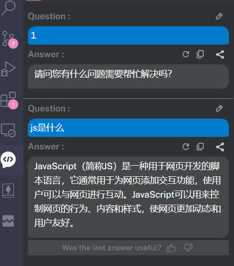
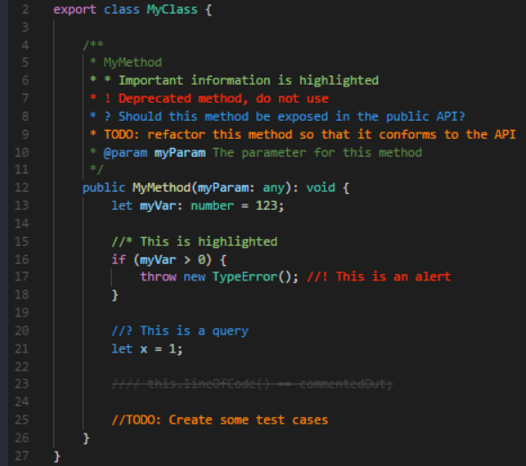
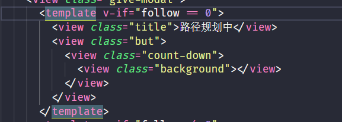
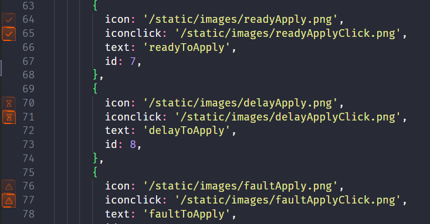
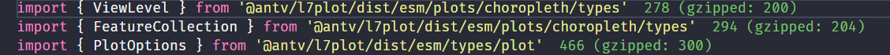
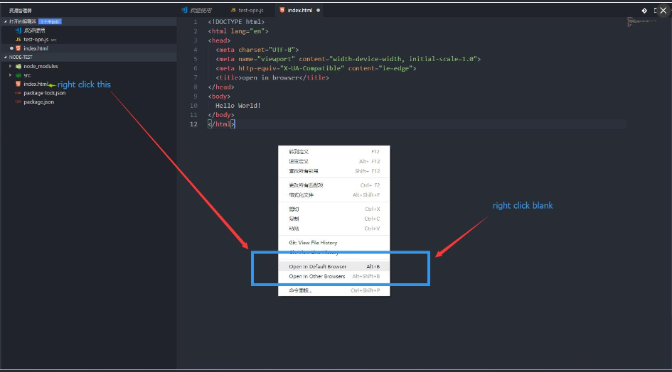
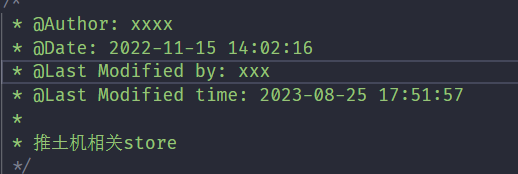

# 插件

-ChatGPT GPT-4 - Bito AI Code Assistant （vscode可用chatgpt功能）

-Bracket Pair Colorizer 2 (提供对应框号高亮效果，该功能已内置vscode)

-Better Comments (注释高亮显示)

-Chinese (Simplified) (vscode语言变为中文)

-Code Runner （可以运行一段代码）

-Dracula Official （vscode主题色设置）

-Eslint （js代码检查工具）

-Git History（查看git提交记录）

-GitHub Repositories （无需下载，直接打开远程git仓库）

-Highlight Matching Tag （高亮选中的标签）

-Image preview （图片预览）

-Import Cost (显示引入包的大小)

-JSON to TS （json文件转ts）

-open in browser （在浏览器内打开）

-Vetur (高亮vue语法)

-vscode-fileheader （提供文件最后修改时间，创建者等信息）
