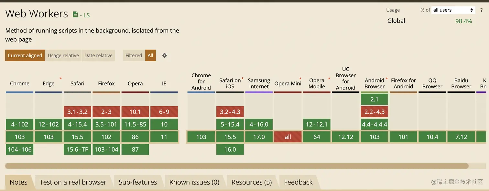
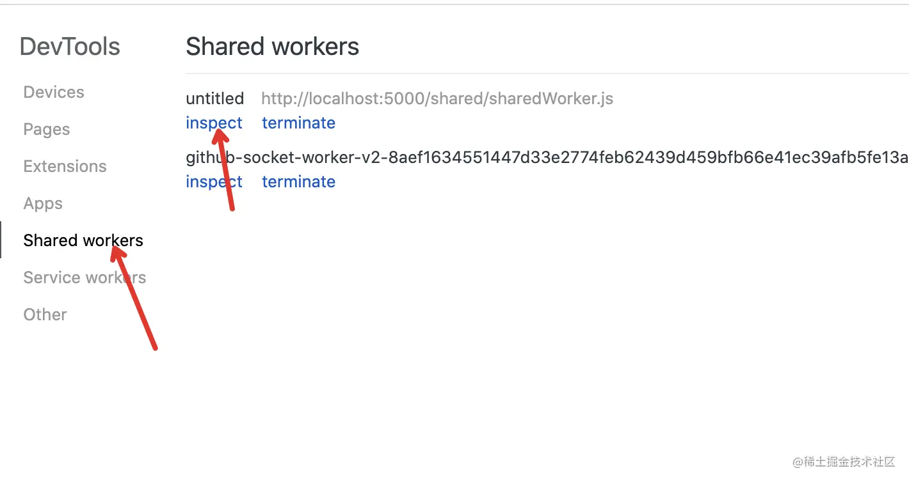
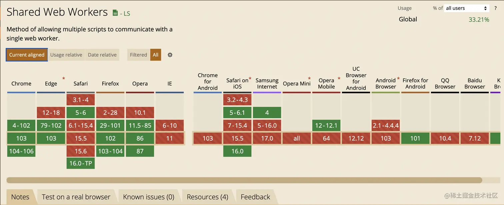

# webWorker

## 产生的背景
随着Web技术的不断演进，JavaScript的单线程模型已经无法满足日益复杂的业务需求和以及带来的性能要求。为了解决这些问题，JavaScript引入了一些如ajax、setTimeout、requestAnimationFrame等机制，但需要明确的是，这些机制不过是通过EventLoop来制造的多线程假象，其并没有改变JavaScript单线程的本质。
至今，现代Web应用中用户交互变得越来越复杂，以及数据处理需求的增加，JavaScript应用需要更强的计算能力和更快的响应性，单线程模型面临着着挑战愈发严重。这就引出了一个关键问题：如何在保持JavaScript的单线程特性的同时，充分利用多核处理器来提高性能以满足用户的需求？在这样的背景下，Web Worker技术应运而生。
## webWorker简介
Web Workers 是一种在浏览器中运行的 JavaScript 脚本，可以在后台线程中执行，独立于主线程。它们提供了一种并行处理任务的方式，可以提高网页的性能和响应性。
Web Workers 可以执行耗时的计算、处理大量数据、执行复杂的算法等任务，而不会阻塞主线程，从而保持页面的流畅性。
* Worker 线程是在浏览器环境中被唤起，但是它与当前页面窗口运行在不同的全局上下文中；
* 顶层对象 window，以及 parent 对象在 Worker 线程上下文中是不可用的；
* Worker 线程上下文中，操作 DOM 的行为也是不可行的，document对象也不存在；
* location和navigator对象可以以可读方式访问；
* 绝大多数 Window 对象上的方法和属性，都被共享到 Worker 上下文全局对象 WorkerGlobalScope 中；
* Worker 线程上下文也存在一个顶级对象 self；
* 与主线程通信需借助postmessage
## 兼容性

## webWorker使用
### 创建
options配置
* name 可选，主要用于调试
* type 可选
    1. classic 默认
    2. module 如果加载为ESModule类型文件，则设置该值
* credentials 可选 
    1. 默认omit不需要携带凭证， 
    2. "same-origin":仅在请求与当前页面具有相同的源（origin）时发送凭据信息。 
    3. "include" : 总是发送凭据信息，即使跨域请求。 
```js
const myWorker = new Worker('./work.js', {
    name: 'work',
    type: 'classic || module',
    credentials: 'omit'
})
```
### 通信
主线程与worker线程相互独立，通信需要借助postmessage
* 参数不可以是callback回调函数
* 无法共享内存： 与传统多线程编程不同，Web Worker不能直接共享内存，主页面与worker之间的数据传递的是通过拷贝而不是共享来完成的。因此在如大文件传输场景下可能会消耗大量内存和处理时间。
* 数据序列化问题： 当主线程与Web Worker之间在数据交换时需要对数据进行序列化和反序列化，序列化会阻塞发送方，而反序列化会阻塞接收方。
```js
// 主线程
const myWorker = new Worker('./worker.js');
// 发
myWorker.postMessage('hello');
//收
myWorker.onmessage = function(e) {
    console.log(e.data);
}

//worker线程
// 发
self.postMessage('hello');
// 收
self.onmessage = function(e) {
    console.log(e.data);
}
```
### 监听错误
* error 监听worker内部错误
* messageError 监听传输数据无法被解析的时候抛出
```js
// 主线程
const myWorker = new Worker('/worker.js'); // 创建worker
myWorker.addEventListener('error', err => {
    console.log(err.message);
});
myWorker.addEventListener('messageerror', err => {
    console.log(err.message)
});
// worker线程
self.addEventListener('error', err => {
    console.log(err.message);
});
self.addEventListener('messageerror', err => {
    console.log(err.message);
});
```
### 关闭
worker 线程的关闭在主线程和 worker 线程都能进行操作，但对 worker 线程的影响略有不同。
* 关闭两种方式
   1. myWorker.terminate()  主线程主动关闭
   2. self.close()  worker线程主动关闭
* 两者相同点
   1. worker 线程当前的 Event Loop 中的任务会继续执行
   2. 下一个EventLoop任务不再理会
* 不同点
   1. 主线程主动关闭，之间的链接会立即关闭，及时当前EventLoop中存在未执行的postMessage消息，主进程也不会收到改消息
   2. worker进程关闭，不会立即断开链接，会等到当前EventLoop任务执行完成再断开链接，当前EventLoop 同步任务，微任务中存在PostMessage，主进程依然会收到消息
```js
// 主线程
const myWorker = new Worker('/worker.js'); // 创建worker
myWorker.terminate(); // 关闭worker
// worker线程
self.close();
```
### worker引入其他文件
如果逻辑繁琐，代码体量较大，都写在一个文件，会造成阅读成本较大，代码逻辑混乱等问题，因此就需要引入其他文件，将其他文件的代码引入到worker中，实现逻辑的复用
worker线程中使用importScripts来引入其他js文件，通过该方法引入的文件不受同源策略的限制
```js
// utils.js
const add = (a, b) => a + b;
// worker.js（worker线程）
// 使用方法：importScripts(path1, path2, ...); 
importScripts('./utils.js');
console.log(add(1, 2)); // log 3
```
### ESModule 模式
当js文件为ESModule写法时，使用importScripts()直接引入会报错，此时就需要初始化时将第二个参数设置为module

原生js引入ESModule类型文件
```js  
<script src="./worker.js" type="module"></script>
```
```js
// 主线程
const worker = new Worker('/worker.js', {
    type: 'module'  // 指定 worker.js 的类型
});
// utils.js
export default add = (a, b) => a + b;
// worker线程
import add from './utils.js'; // 导入外部js
self.addEventListener('message', e => { 
    postMessage(e.data);
});
add(1, 2); // log 3
export default self; // 只需把顶级对象self暴露出去即可
```
### 有了 Web Worker API，JavaScript 是否真的变成了一门多线程语言？
从底层技术角度来看，Web Worker确实具备多线程的特性。然而这与传统多线程编程语言（如Java或C++）有所不同。如，JavaScript中的主线程与Web Worker之间采用的是消息传递来通信，而不是直接共享内存。这意味着Web Worker之间无法直接共享数据，而传统多线程语言则可以直接共享内存，从而实现更直接和高效的线程间通信。
尽管Web Worker从底层技术上看具备多线程的特性，但如今JavaScript的主要应用领域仍然是处理用户界面和用户交互，Web Worker的引入主要是为了改善前端应用的响应性，使其能够更好地处理一些计算密集型任务，而不是将JavaScript彻底转变为多线程编程语言。
总结而言，尽管Web Worker API为JavaScript提供了一定程度的多线程支持，但JavaScript仍然是一门主要依赖于单线程执行的编程语言，Web Worker并没有改变JavaScript的单线程本质。
## SharedWorker 
可被多个页面共享的特殊的worker进程
* 注意点
    1. 全局作用域 SharedWorkerGlobalScope，但是继承自WorkerGlobalScope
    2. SharedWorker 线程的创建和使用跟 worker 类似，事件和方法也基本一样
    3. 主线程与 SharedWorker 线程是通过MessagePort建立起链接，数据通讯方法都挂载在SharedWorker.port上
    4. 采用 addEventListener 来接收 message 事件，那么在主线程初始化SharedWorker() 后，还要调用 SharedWorker.port.start() 方法来手动开启端口
    5. 多个通信页面通信必须同源
```js
// 使用addEventListener监听，需要port开启端口
// 主线程
const myWorker = new SharedWorker('./sharedWorker.js');
myWorker.port.start(); // 开启端口
myWorker.port.addEventListener('message', msg => {
    console.log(msg.data);
})

// 使用onmessage接收消息
// 主线程
const myWorker = new SharedWorker('./sharedWorker.js');
myWorker.port.onmessage = msg => {
    console.log(msg.data);
};
```
### sharedWorker调试
在 sharedWorker 线程里使用 console 打印信息，不会出现在主线程的的控制台中。如果你想调试 sharedWorker，需要在 Chrome 浏览器输入 chrome://inspect/ ，这里能看到所有正在运行的 sharedWorker，然后开启一个独立的 dev-tool 面板。


### 兼容性
sharedWorker 在 Safari 以及移动端的兼容性不是很好



